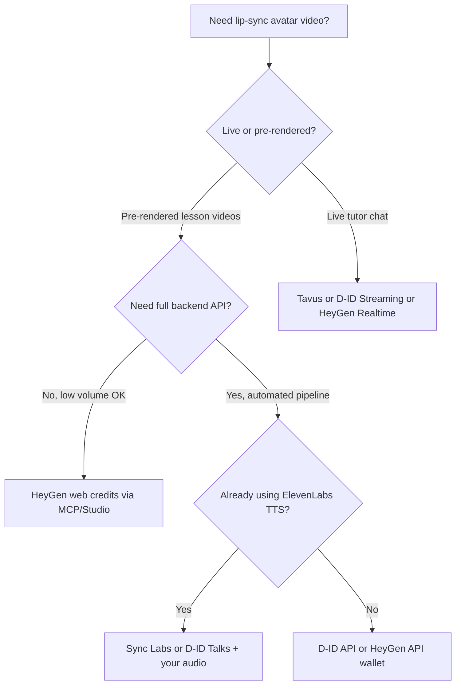
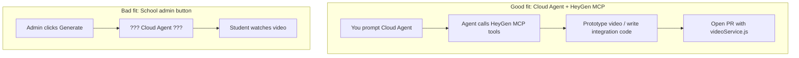

# Lip sync avatar services
_Exported on 7/2/2026 at 14:51:18 CST from Cursor (3.9.16)_

---

**User**

@/Users/juanluissv/.cursor/projects/Users-juanluissv-Desktop-tutors23/agent-transcripts/2015ab26-0368-488d-884f-e787ae1c1114/2015ab26-0368-488d-884f-e787ae1c1114.jsonl ok I think i want to keep looking for options to create the lip sync avatar video I want to find a   api for this service and compare prices, can you recomend services similar to HeyGen ?

---

**Cursor**

Reviewing your prior conversation for context, then researching HeyGen alternatives with API access and pricing.


Based on your prior thread — where you were weighing **HeyGen web credits (~$29/mo → ~200 min Avatar III)** vs **API pay-as-you-go** for tutors23 chapter videos — here is a practical comparison of **HeyGen-like services with APIs**.

---

## Two different problems (pick the right category)

| What you need | Best category | Examples |
|---|---|---|
| **Script → talking avatar video** (batch lesson videos) | Full avatar platforms | HeyGen, D-ID, Synthesia, Elai.io |
| **You already have audio** (e.g. ElevenLabs TTS) + a tutor photo | Lip-sync-only APIs | Sync Labs, D-ID Talks, Tavus lipsync |
| **Live interactive tutor** (real-time chat with face) | Conversational video | Tavus, D-ID streaming, HeyGen Realtime |

For tutors23’s “generate chapter tutor video” flow, you’re mostly in **row 1 or row 2**.

---

## Price comparison (approximate, verify on official pages)

### Full avatar platforms (most similar to HeyGen)

| Service | API? | Entry cost | Effective $/min (rough) | Best fit for you |
|---|---|---|---|---|
| **[HeyGen](https://www.heygen.com/pricing)** | ✅ REST + MCP | Web: **$29/mo** (600 credits) | **~$0.15/min** Avatar III via web credits (3 credits/min) · **~$1/min** via [API wallet](https://developers.heygen.com/docs/pricing) ($0.0167/sec) | Best **value on web plan**; API is much pricier |
| **[D-ID](https://www.d-id.com/pricing/studio/)** | ✅ Mature REST/SDK | Studio Lite **~$5.90/mo** · API Build **~$18/mo** | **~$0.59–1.00/min** on Studio · **~$2.67–3.00/min** pure API pay-per-sec | Strong **developer API**, good for photo→talking head |
| **[Synthesia](https://www.synthesia.io/pricing)** | ✅ (Creator+) | **~$64–89/mo** (Creator) | **~$2–3/min** (30 min/mo included) | Corporate/training polish, not cheapest |
| **[Elai.io](https://elai.io/pricing/)** | ✅ on paid plans | **~$23/mo** (15 min) | **~$1.53/min** included · **$2/min** API overage | Affordable L&D-style avatars, simpler API |
| **[Colossyan](https://www.colossyan.com/pricing)** | ✅ (Business+) | **~$19–27/mo** | **~$1.27–1.80/min** | Training/onboarding focus |
| **[DeepBrain AI](https://www.aistudios.com/pricing)** | ✅ (limited) | **~$30/mo** | **~$2+/min** | Broadcast-style realism |
| **[Tavus](https://www.tavus.io/pricing)** | ✅ | Free tier · **$59/mo** Starter | **~$0.37/min** conversational overage · **~$1/min** video gen overage | Best for **real-time tutor**, not cheapest batch |

### Lip-sync-only (if you use ElevenLabs TTS separately)

| Service | API? | $/min (rough) | Notes |
|---|---|---|---|
| **[Sync Labs](https://sync.so/pricing)** | ✅ | **~$1.50/min** (lipsync-2 @ $0.05/sec) · **~$2.50/min** (lipsync-2-pro) | You supply **video/image + audio**; no avatar library |
| **[D-ID Talks API](https://www.d-id.com/)** | ✅ | **~$2.67–3.00/min** pay-as-you-go | Photo + audio → talking head |
| **[Tavus lipsync API](https://docs.tavus.io/)** | ✅ | Usage-based | `POST /v2/lipsync` with video URL + audio URL |
| **Self-hosted** (Wav2Lip, SadTalker) | N/A | **~$0** software + GPU/hosting | Cheapest at scale, most engineering work |

---

## Top recommendations for tutors23

### 1. **HeyGen (what you already analyzed) — still hard to beat on price via web credits**

If you can live with **OAuth/MCP or manual Studio workflow** (not pure server-side API):

- **Creator $29/mo → ~200 min Avatar III** (your math is correct: 600 credits ÷ 3 credits/min)
- That’s roughly **$0.15/min** — cheaper than almost everything else

**Downside:** MCP/OAuth is awkward for automated “school admin clicks Generate” in production. The [REST API wallet](https://developers.heygen.com/docs/pricing) jumps to **~$1/min** for Avatar III.

---

### 2. **D-ID — best HeyGen alternative if you need a real backend API**

Why it’s worth evaluating:

- Very mature **REST API** and **streaming** for interactive agents
- Works well with **photo avatar + audio** (fits a custom tutor face)
- [API Build plan ~$18/mo](https://www.d-id.com/pricing/studio/) includes ~16 min video (or more streaming minutes depending on tier)

**Tradeoff:** Per-minute API cost is higher than HeyGen web credits, but much better **production integration story** than MCP OAuth.

Good if: you want `Node backend → POST audio + image → get MP4` without human login.

---

### 3. **Sync Labs — cheapest API path if you already have ElevenLabs audio**

Since you liked the Wizard Engineer pattern (ElevenLabs TTS + other pipelines), this is interesting:

```
Chapter text → Map-reduce summary/script → ElevenLabs TTS → Sync Labs lip-sync on tutor photo
```

- [lipsync-2: ~$0.05/sec ≈ $3/min](https://sync.so/docs/product/billing) at base tier
- [lipsync-1.9.0-beta: ~$0.025/sec ≈ $1.50/min](https://sync.so/docs/product/billing) (cheaper, lower quality)
- No avatar library — you bring the face image/video

Good if: you want **full control** over voice (ElevenLabs) and only need mouth movement.

---

### 4. **Tavus — only if you want a live AI tutor, not pre-rendered lessons**

Tavus is excellent for **real-time conversational video** (sub-second latency, WebRTC):

- [Free: 25 conversational min](https://www.tavus.io/pricing)
- [Starter $59/mo: 100 conversational min](https://www.tavus.io/pricing)
- Also has batch video gen + lipsync API

Good if: students **talk to the tutor live** on the lesson page.  
Overkill if: you only need **offline chapter videos**.

---

### 5. **Synthesia / Elai.io — solid but usually not cheapest**

- **Synthesia**: polished for training, API from Creator (~$64/mo), ~30 min/mo — great compliance, not budget-first
- **Elai.io**: [~$23/mo for 15 min](https://elai.io/pricing/), API on paid plans, [$2/min overage](https://elai.io/pricing/) — decent mid-tier option

---

## Side-by-side for your likely workflow

**Scenario: 100 chapter videos × 3 min = 300 min/month**

| Approach | Est. monthly cost | Integration | Quality |
|---|---|---|---|
| HeyGen web credits (Avatar III) | **~$45** (2× Creator plans or Business tier) | MCP/OAuth or manual — awkward for automation | High |
| HeyGen API (Avatar III) | **~$300** | Easy REST API | High |
| D-ID API | **~$800–900** (pay-per-sec) or ~$198 Scale plan + overage | Easy REST API | Good |
| ElevenLabs TTS + Sync Labs lipsync-2 | TTS (~$50–100?) + **~$450** lipsync | Two APIs, more glue code | Good |
| Elai.io Team + API overage | **~$100 plan + ~$500 overage** | REST API | Good |
| Self-hosted Wav2Lip/SadTalker | **GPU hosting ~$50–200** | Hardest to build/maintain | Variable |

*(Rough estimates — always confirm current rates.)*

---

## What I’d actually evaluate next (in order)

1. **[D-ID API](https://www.d-id.com/)** — if you need proper server-side automation today  
2. **[Sync Labs](https://sync.so/)** — if ElevenLabs TTS is already in your stack  
3. **Keep HeyGen web credits** — if volume stays low (~200 min/mo) and you can tolerate MCP/manual workflow for now  
4. **[Tavus](https://www.tavus.io/)** — only if you pivot to **live conversational tutor** on `StudentLessonPageScreen`  
5. **Synthesia / Elai** — if you need enterprise training features more than cost  

---

## Important pricing traps (from your HeyGen research)

These apply across vendors:

- **Web credits ≠ API pricing** (HeyGen is the clearest example)
- **Credits don’t roll over** month to month
- **Re-renders count** against quota
- **Premium avatars cost more** (HeyGen Avatar IV/V, D-ID premium models, etc.)
- **Streaming/real-time** often has different multipliers than batch video

---

## Quick decision tree



---

If you tell me which path you prefer — **(A) batch chapter videos from school admin** vs **(B) live tutor on the student lesson page** — I can narrow this to 2–3 vendors and sketch the exact API flow (endpoints, webhooks, where it plugs into your existing `bookLessonsController` / generation pipeline). I'm in Ask mode so I can only advise, but that architectural mapping would be straightforward.

---

**User**

batch chapter videos from school admin  usign api compare 6 minutes video cost 

---

**Cursor**

Gathering official API pricing to calculate the cost of one 6-minute batch chapter video across providers.


For **batch chapter videos from school admin via API** (script/audio → talking avatar MP4), here is a **6-minute video cost comparison**.

Assumptions:
- **6 minutes = 360 seconds** of output video
- **API billing only** (not HeyGen web/MCP credits)
- One talking-head lesson video (not live streaming)
- Prices from official docs — verify before buying

---

## Cost of one 6-minute chapter video (API)

| Rank | Service | API model | **Cost for 6 min** | Min. subscription | Notes |
|:---:|---|---|---:|---|---|
| 1 | **[HeyGen](https://developers.heygen.com/docs/pricing)** | Avatar III Digital Twin | **~$6.01** | None ($5 wallet min) | Best pure API value if you use Avatar III |
| 2 | **[HeyGen](https://developers.heygen.com/docs/pricing)** | Avatar III Photo Avatar | **~$15.59** | None | Photo-based tutor face |
| 3 | **[D-ID](https://www.d-id.com/faqs/)** | Credits from Pro plan | **~$6.40*** | **~$16/mo** (annual) | 6 min = 24 credits (15-sec blocks) |
| 4 | **[Synthesia](https://synthesia.noticeable.news/publications/introducing-credits-instead-of-minutes)** | Creator plan credits | **~$12.80*** | **~$64/mo** (annual) | 6 min = 720 credits (120/min) |
| 5 | **[Elai.io](https://elai.io/pricing/)** | Top-up / overage | **$12.00** | **~$23/mo** (15 min incl.) | $2/min beyond plan minutes |
| 6 | **[HeyGen](https://developers.heygen.com/docs/pricing)** | Lip-sync Speed (video+audio) | **~$11.99** | None | You supply base video + audio |
| 7 | **[HeyGen](https://developers.heygen.com/docs/pricing)** | Avatar IV Photo/Studio | **~$18–24** | None | Higher quality, much pricier |
| 8 | **[Sync Labs](https://sync.so/docs/product/billing)** + TTS | lipsync-2 + ElevenLabs | **~$18.45** | **~$5/mo** + TTS | Lip-sync only — you build the pipeline |
| 9 | **D-ID** (pay-per-sec estimate) | Talks API ~$0.05/sec | **~$18.00** | Varies | If billed per-second outside plan |
| 10 | **[Tavus](https://www.tavus.io/pricing)** | Batch video gen overage | **~$6.00** | **$59/mo** Starter | ~$1/min overage; better for live tutor |

\* *Effective cost = share of your monthly plan allowance, not a standalone per-video invoice.*

---

## How each number is calculated

### HeyGen API ([official rates](https://developers.heygen.com/docs/pricing))

| Avatar type | Rate/sec | **6 min (360 sec)** |
|---|---:|---:|
| Avatar III Digital Twin | $0.0167 | **$6.01** |
| Avatar III Photo Avatar | $0.0433 | **$15.59** |
| Avatar IV Photo Avatar | $0.05 | **$18.00** |
| Avatar IV Digital Twin / Studio | $0.0667 | **$24.01** |
| Lip-sync only (Speed) | $0.0333 | **$11.99** |
| TTS (Starfish) add-on | $0.000667 | **~$0.24** |

**Winner for batch API:** Avatar III Digital Twin at **~$1/min**.

---

### D-ID API ([credit FAQ](https://www.d-id.com/faqs/))

- **1 credit = up to 15 seconds** (rounded up)
- **6 min = 24 credits**

| Plan | Monthly cost | Credits | Max video | **Effective 6-min cost** |
|---|---:|---:|---:|---:|
| Lite | ~$4.70 | 40 | ~10 min | **~$2.82** (watermarked) |
| Pro | ~$16 | 60 | ~15 min | **~$6.40** |
| Advanced | ~$108 | 400 | ~100 min | **~$6.48** |

API uses the **same credit pool** as Studio ([D-ID pricing](https://www.d-id.com/pricing/studio/)).

**Good pick if:** you want a solid Node REST API and can stay within ~15 min/mo on Pro.

---

### Synthesia API ([credits announcement](https://synthesia.noticeable.news/publications/introducing-credits-instead-of-minutes))

- **1 min video = 120 credits**
- **6 min = 720 credits**
- API requires **Creator+** ([Synthesia pricing](https://www.synthesia.io/pricing))

| Billing | Plan cost | Credits/mo | Video capacity | **6-min effective cost** |
|---|---:|---:|---:|---:|
| Annual | $64/mo | 3,600 | ~30 min | **~$12.80** |
| Monthly | $89/mo | 3,600 | ~30 min | **~$17.80** |

**Tradeoff:** polished enterprise output, but **~2× HeyGen** for the same 6-min clip.

---

### Elai.io API ([pricing](https://elai.io/pricing/))

- Public API on paid plans
- **Extra minutes: $2/min** flat

| Scenario | **6-min cost** |
|---|---:|
| Within Creator plan (15 min/mo @ $23) | **~$9.20** (allocation share) |
| Top-up / overage | **$12.00** |

**Caveat:** every re-render costs again ([Elai FAQ](https://elai.io/pricing/)).

---

### Sync Labs + ElevenLabs (two-API pipeline)

Best if you already want **ElevenLabs voice** + lip-sync on a tutor photo:

| Step | Cost for 6 min |
|---|---:|
| ElevenLabs TTS (~4,500 chars, Flash) | **~$0.23** |
| Sync Labs lipsync-2 @ $0.05/sec | **$18.00** |
| **Total** | **~$18.23** |

Cheaper Sync model (lipsync-1.9 @ $0.025/sec): **~$9.23 total** — lower quality.

---

## Visual comparison (one 6-min chapter)

```text
HeyGen Avatar III (API)     ████░░░░░░░░░░░░░░░░  ~$6
D-ID Pro (within plan)      ████░░░░░░░░░░░░░░░░  ~$6.40
Elai (plan allocation)      ██████░░░░░░░░░░░░░░  ~$9–12
HeyGen Lip-sync only        ██████░░░░░░░░░░░░░░  ~$12
Synthesia Creator           ████████░░░░░░░░░░░░  ~$13
Elai overage ($2/min)       ████████░░░░░░░░░░░░  $12
Sync Labs + ElevenLabs      ████████████░░░░░░░░  ~$18
HeyGen Avatar IV            ████████████░░░░░░░░  ~$18–24
```

---

## What this means for tutors23 (school admin batch)

### If you generate **1 chapter video × 6 min**
**Cheapest real API paths:**
1. **HeyGen API — Avatar III Digital Twin → ~$6**
2. **D-ID Pro API — ~$6.40** (but you pay **$16/mo** even for one video)
3. **Elai — ~$9–12** depending on plan vs overage

### If you generate **many chapters** (example: 10 chapters × 6 min = 60 min/mo)

| Provider | Est. monthly API cost |
|---|---:|
| **HeyGen Avatar III API** | **~$60** (pure usage, no sub) |
| **D-ID Advanced** | **~$108** (100 min incl.) + overage for last 20 min |
| **Synthesia Creator** | **$64–89** plan but only **30 min** — need upgrade/Enterprise |
| **Elai Team + overage** | **$100 plan + ~$20 overage ≈ $120** |

At scale, **HeyGen API pay-as-you-go** usually wins on math — your earlier web-credit deal ($29 → 200 min) is still cheaper, but that is **not API**.

---

## Recommended shortlist for your use case

| Priority | Pick | Why |
|:---:|---|---|
| **#1** | **HeyGen REST API (Avatar III)** | ~**$6/chapter**, no subscription, fits `bookLessonsController` batch job |
| **#2** | **D-ID Talks API + Pro plan** | Similar per-video cost, mature API, good if you want photo avatar + ElevenLabs audio input |
| **#3** | **Elai.io** | Simple REST, but **$12/chapter** on overage and re-renders hurt |
| **Skip for now** | Synthesia, Tavus, Colossyan API | Synthesia/Colossyan = expensive or Enterprise-gated; Tavus = live conversational, not batch lessons |

---

## Hidden costs to budget (all vendors)

- **Re-renders** after script edits (full duration charged again)
- **Avatar creation** (HeyGen: $1/call for photo/digital twin)
- **Webhook/polling** dev time (async jobs — typical 5–15 min render)
- **Storage** (S3 for MP4s in your app)
- **Rounding** (D-ID rounds to 15-sec blocks)

---

## Example API flow for school admin (conceptual)

```text
Admin clicks "Generate chapter video"
  → Backend builds script from chapter text (Map-reduce)
  → POST HeyGen/D-ID API (script + avatar_id + voice)
  → Poll/webhook until done
  → Save MP4 URL on BookLesson document
  → Student plays video on lesson page
```

---

**Bottom line:** For a **6-minute batch chapter video via API**, budget **~$6–7** with **HeyGen Avatar III** or **D-ID Pro credits** — roughly **$12–18** with Synthesia, Elai, or split TTS+lipsync stacks.

If you share how many chapters/month you expect (e.g. 5, 20, or 100), I can calculate the **monthly total** and pick one vendor definitively.

---

**User**

what is Wav2Lip, SadTalker (Self-hosted ) how would that work ? 

---

**Cursor**

Explaining Wav2Lip and SadTalker as self-hosted lip-sync options and how they'd fit a batch chapter-video pipeline like tutors23.


**Wav2Lip** and **SadTalker** are open-source AI models you run on **your own server** (with a GPU). They take a **face image or video** plus **audio**, and output a **talking-head video** with lip sync — no HeyGen/D-ID subscription per minute.

They are **not** full avatar platforms. You bring the tutor face, the script/audio, and the hosting.

---

## What each one does

| | **Wav2Lip** | **SadTalker** |
|---|---|---|
| **GitHub** | [Rudrabha/Wav2Lip](https://github.com/Rudrabha/Wav2Lip) | [OpenTalker/SadTalker](https://github.com/OpenTalker/SadTalker) |
| **Main job** | Lip-sync only | Lip-sync + head motion + blinking |
| **Input** | Face **video** (or still image) + audio | Single **photo** + audio |
| **Output feel** | Mouth moves; rest of face mostly static | More “alive” — slight head turns, expressions |
| **Quality** | Good lip sync; can look pasted-on | More natural motion; can blur at 512px+ |
| **Speed** | Faster | Slower (especially with GFPGAN enhancer) |
| **Best for** | You already have a tutor video clip | You only have a tutor **photo** |

**Simple analogy:**

- **Wav2Lip** = “make this mouth match this audio”
- **SadTalker** = “turn this photo into a short talking clip”

---

## How self-hosted would work (end-to-end)

For tutors23 batch chapter videos, the pipeline looks like this:


### Step-by-step

1. **Script** — Your backend turns chapter text into a lesson script (Map-reduce, same idea as summaries/study guides).

2. **Audio** — TTS produces `chapter-7.wav`:
   - **ElevenLabs API** (~$0.23 for 6 min), or
   - Local TTS (Coqui, Piper, etc.) — free but more setup.

3. **Face source**
   - **SadTalker:** one photo (`tutor.jpg`)
   - **Wav2Lip:** a short loop video of the tutor works better than a single frame

4. **GPU service** — A Python worker runs inference:
   ```bash
   # SadTalker example
   python inference.py \
     --driven_audio chapter-7.wav \
     --source_image tutor.jpg \
     --result_dir ./output \
     --enhancer gfpgan \
     --size 512
   ```

5. **Post-process** — FFmpeg merges audio/video, normalizes format (H.264 MP4).

6. **Store** — Upload MP4 to S3 (or similar), save URL in MongoDB on the lesson/chapter document.

7. **Serve** — Student lesson page plays the video like any other asset.

---

## Architecture in your stack

Your app is **MERN + Express**. Self-hosted lip sync is usually a **separate GPU microservice**, not inside the main Node process.

```text
┌─────────────────────┐     ┌──────────────────────────┐
│  tutors23 Express   │     │  GPU worker (Python)      │
│  bookLessonsController│───▶│  FastAPI + Celery/RQ      │
│  POST /generate-video │     │  SadTalker / Wav2Lip      │
└─────────────────────┘     └──────────────────────────┘
         │                              │
         ▼                              ▼
    MongoDB (job status)          S3 (MP4 files)
```

**Typical pattern:**

| Layer | Tech |
|-------|------|
| API gateway | Express route: `POST /api/book-lessons/:id/generate-video` |
| Job queue | BullMQ / Redis — video gen takes minutes, not seconds |
| Worker | Python FastAPI container with CUDA |
| Models | SadTalker checkpoints (~5GB on disk) |
| Storage | S3 for inputs (photo, wav) and outputs (mp4) |
| Auth | Internal token between Node ↔ Python service |

Example flow:

```text
Admin click
  → Express creates job { status: 'queued' }
  → Worker: TTS → SadTalker → upload MP4
  → Webhook or poll: { status: 'done', videoUrl: '...' }
```

---

## What you need to run it

| Requirement | Minimum | Recommended (6 min chapters) |
|-------------|---------|------------------------------|
| **GPU** | NVIDIA 4GB VRAM | **8–16GB** (RTX 3060/3080, A10) |
| **CUDA** | 11.x+ | Match PyTorch build |
| **Python** | 3.8+ | 3.10–3.11 in Docker |
| **FFmpeg** | Required | Required |
| **Disk** | ~5GB models | ~20GB+ with checkpoints + temp files |
| **RAM** | 8GB | 16GB+ |

**Docker** is the usual approach — e.g. a SadTalker image with `--gpus all`.

**Rough render time** (not real-time):

| Output | GPU | ~10 sec video | ~6 min video (estimate) |
|--------|-----|---------------|---------------------------|
| SadTalker 256px | RTX 3060 | ~30 sec | **~15–30 min** |
| SadTalker 512 + GFPGAN | RTX 4090 | ~45 sec | **~30–60+ min** |

Long chapters are slow on CPU; GPU is effectively required for batch production.

---

## Cost: self-hosted vs HeyGen API

For **one 6-minute chapter**:

| Approach | Direct cost | Hidden cost |
|----------|-------------|-------------|
| **HeyGen API** (Avatar III) | **~$6** | None — they host GPU |
| **SadTalker on RunPod RTX 4090** | **~$0.40–2** GPU time | DevOps, queue, failures, quality tuning |
| **Own GPU server** | **~$50–200/mo** fixed | Maintenance, scaling, model updates |

Self-hosted wins at **high volume** (many hours/month). At low volume (e.g. 10 × 6 min = 60 min/mo), **HeyGen ~$60** can be simpler than running GPU infra.

---

## Wav2Lip vs SadTalker — which for tutors23?

For **school admin batch chapter videos**:

| Choose | When |
|--------|------|
| **SadTalker** | You have a **tutor photo** per subject/school; you want head movement from a still image |
| **Wav2Lip** | You have a **short tutor video loop**; you only need accurate lips |
| **HeyGen/D-ID API** | You want quality + speed without owning GPU/DevOps |

Many production setups use **SadTalker for motion** and optionally **Wav2Lip as a refinement pass** on the mouth region.

---

## Pros and cons (honest)

### Pros

- **No per-minute API bill** at scale
- **Full control** — custom tutor face, no vendor lock-in
- **Data stays on your infra** (helpful for schools)
- **Pairs well with ElevenLabs** (you already like that pattern)

### Cons

- **You are the platform team** — GPU, Docker, queues, monitoring, retries
- **Quality below HeyGen Avatar III/IV** — especially on long 6-min clips
- **Long videos are hard** — SadTalker is often used for **short clips** (30s–2min); 6 min may need chunking + stitching
- **No stock avatars** — you create/bring every tutor face
- **Research code** — not a polished SaaS; edge cases (profile faces, glasses, dark skin tones) need testing
- **No built-in TTS** — you wire TTS yourself

---

## Practical gotcha: 6-minute chapters

SadTalker/Wav2Lip are often tuned for **short talking heads**. For **6-minute lessons**, common patterns:

1. **Chunk** script into 30–60 sec segments → render each → **FFmpeg concat**
2. **One long render** — possible but slow and quality can drift
3. **Hybrid** — self-host short intros; use HeyGen API for full chapters

Chunking also helps retries (one failed segment ≠ redo whole chapter).

---

## Minimal implementation sketch (conceptual)

**Express (job creator):**
```javascript
// Pseudocode — not in your repo yet
async function generateChapterVideo(lessonId, chapterText, tutorImageUrl) {
  const job = await VideoJob.create({ lessonId, status: 'queued' })
  await videoQueue.add('render', {
    jobId: job._id,
    script: chapterText,
    tutorImageUrl,
  })
  return job
}
```

**Python worker (SadTalker):**
```python
# Pseudocode
def render_talking_head(image_path, audio_path, out_path):
    # 1. optional: split audio into 60s chunks
    # 2. run SadTalker per chunk
    # 3. ffmpeg concat → final mp4
    # 4. upload to S3, callback Node webhook
    pass
```

---

## When self-hosted makes sense for you

| Situation | Recommendation |
|-----------|----------------|
| Prototype / &lt; 20 videos/month | **HeyGen or D-ID API** |
| 100+ videos/month, have DevOps | **Self-hosted SadTalker** worth evaluating |
| Need best lip sync on existing video | **Wav2Lip** |
| Need “photo → talking tutor” | **SadTalker** |
| Need enterprise polish + zero GPU ops | **Stick with APIs** |

---

## Bottom line

**Wav2Lip** and **SadTalker** are **self-hosted lip-sync engines**: photo/video + audio → MP4. For tutors23, they would sit as a **GPU microservice** behind your Express backend, with **TTS upstream** and **S3 + MongoDB downstream** — same batch job pattern as HeyGen, but you run the models and absorb GPU/DevOps work in exchange for lower marginal cost at scale.

If you want, I can next outline a **concrete tutors23 design**: chunking strategy for 6-min chapters, queue schema, and SadTalker vs HeyGen API break-even by videos/month — still in Ask mode, guidance only.

---

**User**

what about using https://cursor.com/docs/cloud-agent  a cursor AI agent (run in isolated VMs in the cloud ), can that work with HeyGen MCP 

---

**Cursor**

Checking how Cloud Agents handle MCP (especially OAuth) and how that compares to HeyGen MCP requirements.


**Yes — technically it can work.** A [Cursor Cloud Agent](https://cursor.com/docs/cloud-agent) can use [HeyGen Remote MCP](https://developers.heygen.com/mcp/overview) the same way your local Cursor agent can. It is a strong fit for **prototyping and dev-time generation**, not for **production batch videos** when a school admin clicks “Generate” in tutors23.

---

## Short answer

| Question | Answer |
|----------|--------|
| Can Cloud Agent + HeyGen MCP connect? | **Yes** |
| Does HeyGen support Cursor? | **Yes** — listed in [HeyGen MCP supported products](https://developers.heygen.com/mcp/overview) |
| Good for school-admin batch chapter videos in production? | **No** |
| Good for testing / building the feature? | **Yes** |

---

## Why it works technically

[Cloud Agents support MCP](https://cursor.com/docs/cloud-agent/capabilities):

- HTTP and stdio transports
- **OAuth supported** (per-user, including team-shared MCP servers)
- Configure via **cursor.com/agents** MCP dropdown or team **Dashboard → Integrations & MCP**

HeyGen MCP setup:

```text
Endpoint: https://mcp.heygen.com/mcp/v1/
Auth:     OAuth (no API key)
Billing:  Your HeyGen web plan credits
```

Relevant tools for your use case:

- `create_video_from_avatar` — script/audio + avatar → video  
- `create_speech` — TTS  
- `create_video_from_image` — photo + audio lip-sync  
- `get_video` — poll until render completes  

So you could start a Cloud Agent and say something like:

> “Using HeyGen MCP, create a 6-minute chapter tutor video from this script with avatar X.”

The agent would call those tools and bill **your connected HeyGen account**.

---

## How OAuth works on Cloud Agents (important)

From [Cloud Agent MCP docs](https://cursor.com/docs/cloud-agent/capabilities):

- **HTTP MCP (recommended):** credentials are **proxied through Cursor’s backend** — the VM does not hold refresh tokens directly.
- **OAuth is per-user:** whoever completes the HeyGen OAuth flow owns that connection and **their HeyGen credits** are charged.

Implications:

- Your personal HeyGen Creator plan credits get used when **you** run the Cloud Agent.
- Teammates need their **own** OAuth connection unless you share one HeyGen account (not ideal).
- This is **not** a shared “school platform” billing model.

---

## Cloud Agent vs production pipeline



### What Cloud Agents are for

Per [Cloud Agents docs](https://cursor.com/docs/cloud-agent):

- Isolated VMs for **coding tasks**
- Clone repo → change code → test → open PR
- Parallel dev work without your laptop online
- MCP for **developer tools** (DB, APIs, etc.)

### What school-admin batch generation needs

- **Your Express backend** (`bookLessonsController`) receives the request
- **Deterministic job queue** (Redis/BullMQ)
- **Webhook/polling** for async HeyGen renders
- **S3 + MongoDB** storing `videoUrl` on the lesson
- Runs **24/7**, not only when a Cursor agent session exists

A Cloud Agent is a **developer assistant**, not a video microservice.

---

## Could you trigger Cloud Agents via API for batch videos?

Cloud Agents can be started from the [Cursor API](https://cursor.com/docs/cloud-agent), but that still means:

- Each run is an **AI coding session** (model tokens + spend limit)
- Outcome is **non-deterministic** (“make a video” vs exact pipeline)
- Tied to **Cursor billing** (API pricing for models in Max Mode) **plus** HeyGen credits
- Not designed for hundreds of chapter videos/month

That would be far more expensive and fragile than:

```text
Express → HeyGen REST API (or D-ID) → S3 → MongoDB
```

---

## HeyGen MCP vs HeyGen REST API (for tutors23)

| | **HeyGen MCP (Cloud Agent or local Cursor)** | **HeyGen REST API (production)** |
|---|---|---|
| Auth | OAuth → **web plan credits** | API key → **pay-as-you-go wallet** |
| Cost (6 min Avatar III) | ~**$0.90** web credits (3 credits/min) | ~**$6** API |
| Who runs it | Cursor agent session | Your Node server |
| Fits admin button? | No | Yes |
| Fits prototyping? | Yes | Yes (with `$5` wallet) |

MCP is cheaper on credits but wrong runtime for production. REST API is the right integration pattern even if it costs more per minute.

---

## Domain whitelisting note

HeyGen MCP uses [domain whitelisting](https://developers.heygen.com/mcp/overview) for custom agents. Cursor is listed as a supported product, so marketplace setup usually works. Custom domains need the [Integration Intake form](https://form.typeform.com/to/m3EYcOaM).

For Cloud Agents, use the **official HeyGen connector in Cursor’s MCP marketplace** rather than rolling your own HTTP client in the VM.

---

## Practical ways to use Cloud Agent + HeyGen MCP

### 1. Prototype one chapter video (good)

- Connect HeyGen MCP on [cursor.com/agents](https://cursor.com/agents)
- OAuth into your HeyGen account
- Paste chapter script → agent calls `create_video_from_avatar`
- Compare quality/cost before committing to an API vendor

### 2. Build the real integration (good)

Ask a Cloud Agent:

> “Add a `POST /api/book-lessons/:id/generate-video` route that calls HeyGen REST API with our API key, polls until done, uploads to S3, saves URL on the lesson model.”

The agent **writes the production code**; production does **not** use MCP at runtime.

### 3. LangChain agent in tutors23 calling HeyGen MCP (possible, awkward)

From your earlier thread: LangChain + `@langchain/mcp-adapters` + HeyGen MCP can work for **experiments**, but for school-admin batch jobs you want a **direct REST call**, not an LLM deciding when/how to call video tools.

### 4. Replace your backend with Cloud Agents (bad)

Do not route admin “Generate video” → Cursor Cloud Agent. Wrong tool, wrong billing, wrong reliability.

---

## Recommended architecture for tutors23

```text
Phase 1 — Prototype (Cloud Agent + HeyGen MCP)
  You test avatar, script length, 6-min quality
  Uses your $29 HeyGen web credits cheaply

Phase 2 — Production (Express + HeyGen REST API or D-ID)
  School admin button → job queue → video API → S3 → MongoDB
  No Cursor agent in the request path

Phase 3 — Optional LangChain agent (student chat only)
  RAG tutor chat — separate from video generation
```

---

## Bottom line

**Cloud Agent + HeyGen MCP works** for you as a developer: connect OAuth on [cursor.com/agents](https://cursor.com/agents), use HeyGen tools to test chapter videos, and have the agent implement the real REST integration in tutors23.

It does **not** replace a production video pipeline for school admins. For that, use **HeyGen REST API** (automated, server-side) or **D-ID API**, with MCP kept for **prototyping and development only**.

If you want, I can outline the exact Cloud Agent prompt to prototype one 6-minute chapter video, and the separate Express job design for production — still Ask mode, guidance only.

---

**User**

when admin clicks generate i can call the cursor cloud agent using an API https://cursor.com/docs/cloud-agent , can the cloud agent use my heygen personal account with different admins ? I just will use the heygen mcp with the cloud agent to create the video, after that i will use something else to get the video ( like the api )

---

**Cursor**

Checking Cursor's Cloud Agent API and how HeyGen MCP OAuth behaves across users and programmatic triggers.


**Partially yes on the API trigger — no on “different admins each use my personal HeyGen.”** Your hybrid idea (MCP to create, HeyGen API to fetch) is technically possible but fragile and expensive for production.

---

## Your proposed flow

```text
School admin clicks "Generate"
  → tutors23 Express calls Cursor Cloud Agents API
  → Cloud Agent uses HeyGen MCP (your personal account)
  → Video gets created
  → Express fetches video via HeyGen REST API
  → Save URL for students
```

---

## Part 1: Can admin click trigger a Cloud Agent via API?

**Yes.** The [Cloud Agents API](https://cursor.com/docs/cloud-agent/api/endpoints) supports this:

```bash
POST https://api.cursor.com/v1/agents
Authorization: Basic YOUR_CURSOR_API_KEY:
```

You can omit `repos` to start a **no-repo agent** (no git/PR needed):

```json
{
  "prompt": {
    "text": "Use HeyGen MCP. Create a 6-minute tutor video from this script: ..."
  },
  "mcpServers": [
    {
      "name": "heygen",
      "type": "http",
      "url": "https://mcp.heygen.com/mcp/v1/"
    }
  ]
}
```

Then poll run status:

```text
GET /v1/agents/{agentId}/runs/{runId}
GET /v1/agents/{agentId}/runs/{runId}/stream   ← tool_call events with MCP results
```

Notes from the [Cloud Agents docs](https://cursor.com/docs/cloud-agent):

- API is in **public beta** (may change)
- **Webhooks coming soon** in v1 — today you mostly **poll/stream**
- Cloud Agents bill **Cursor model usage** (Max Mode) on top of HeyGen credits
- Only **one active run per agent** at a time (`409 agent_busy`)

So the trigger works — but you’re using a **coding agent runtime** as a video worker.

---

## Part 2: Can one personal HeyGen account serve different school admins?

**Not the way you’re imagining.**

### What actually happens

| Who | What gets billed / authenticated |
|-----|----------------------------------|
| School Admin A in tutors23 | Nothing — they’re not in HeyGen or Cursor OAuth |
| School Admin B in tutors23 | Same |
| **Your** HeyGen account (OAuth) | **All** MCP-generated videos |

HeyGen MCP uses **OAuth tied to one HeyGen account** ([HeyGen MCP overview](https://developers.heygen.com/mcp/overview)). Cloud Agent MCP OAuth is **per Cursor user** ([Cloud Agent capabilities](https://cursor.com/docs/cloud-agent/capabilities)) — not per tutors23 admin.

So:

- ✅ All admins can trigger generation **through your backend**
- ❌ They do **not** each use their own HeyGen account
- ❌ Your **personal** HeyGen credits pay for **everyone’s** videos
- ❌ You can’t pass “Admin A’s HeyGen” vs “Admin B’s HeyGen” through MCP today

```text
Admin A ──┐
Admin B ──┼──► YOUR Express ──► Cursor API ──► YOUR HeyGen OAuth
Admin C ──┘                                      (one credit pool)
```

### Multi-tenant implication

If tutors23 is a product for many schools, running everything on **your personal HeyGen plan** is usually wrong for:

- **Billing** — you absorb all video cost
- **Quotas** — 600 credits/mo gets consumed fast
- **Terms** — personal/creator plans often aren’t meant for multi-customer SaaS
- **Support** — one account, one failure point

For production you typically want **one platform HeyGen API key** (or org account), not personal MCP OAuth per admin.

---

## Part 3: MCP to create + HeyGen API to fetch — does that work?

**Yes, in theory.** That’s the most coherent version of your idea.

### Create (MCP — cheap web credits)

Cloud Agent calls e.g. `create_video_from_avatar` → HeyGen returns a `video_id` (async render).

### Fetch (REST API — usually just read)

Your Express backend:

```text
GET HeyGen /videos/{video_id}   ← poll until status = completed
→ download video_url → upload to S3 → save on lesson
```

Important: **GET/list videos** typically uses a **HeyGen API key** (different auth from MCP OAuth). Creating via MCP bills **web credits**; fetching via REST is a separate credential — both can point at the same HeyGen workspace if configured correctly.

### How to get `video_id` back to Express

The agent doesn’t automatically POST to your webhook. Options:

| Method | Reliability |
|--------|-------------|
| Parse `run.result` text | ⚠️ Fragile — agent might not return clean JSON |
| Stream `tool_call` events, read MCP `result` | ✅ Better — [API stream docs](https://cursor.com/docs/cloud-agent/api/endpoints) expose tool results |
| Agent writes `video_id` to a file/artifact | ⚠️ Awkward for no-repo agents |

Example of what you’d watch in the stream:

```json
{
  "name": "mcp",
  "status": "completed",
  "result": { "...video_id..." }
}
```

You’d still need robust parsing, retries, and timeouts (6-min HeyGen renders can take 10–20+ minutes).

---

## Part 4: Why this is a bad production architecture

### Cost stack (one 6-min chapter)

| Line item | Rough cost |
|-----------|------------|
| HeyGen MCP (Avatar III, web credits) | ~**18 credits** (~$0.90 on Creator plan) |
| Cursor Cloud Agent (Max Mode tokens) | ~**$1–10+** per run (model + long prompt + tool loop) |
| Your Express polling / infra | engineering time |
| **Total** | Often **more** than HeyGen REST API alone (~$6) |

You save on HeyGen credits but pay Cursor for an LLM to do a job a **direct API call** does deterministically.

### Reliability

| Direct HeyGen REST API | Cloud Agent + MCP |
|------------------------|-------------------|
| Deterministic request | Agent may pick wrong tool |
| Known request/response | Must parse natural language / tool stream |
| One HTTP job queue | Agent busy, run failures, retries |
| Production pattern | Prototype / hack pattern |

### Operational gaps

- **v1 webhooks not ready** — long polling on Cursor + HeyGen
- **Agent may edit code** if a repo is attached (don’t attach `tutors23` for video-only jobs)
- **OAuth can expire** — breaks unattended runs
- **Rate limits** on Cursor API (beta)

---

## What I’d recommend instead

### If you want cheap HeyGen (web credits)

Use MCP **manually** while building — not in the admin button path.

### If you want admin button → video (production)

```text
Admin click
  → Express job queue
  → HeyGen REST API directly (create + poll)
  → S3 + MongoDB
```

No Cursor in the request path.

### If you still want Cursor API somewhere

Use it to **implement** the feature, not **run** it:

> “Add `videoGenerationService.js` that calls HeyGen REST API with HEYGEN_API_KEY, polls until complete, uploads to S3.”

Trigger **that** Cloud Agent once from the API — not one agent run **per chapter video**.

---

## Decision table

| Question | Answer |
|----------|--------|
| Can admin click call Cloud Agents API? | **Yes** ([API endpoints](https://cursor.com/docs/cloud-agent/api/endpoints)) |
| Can each admin use their own HeyGen via MCP? | **No** — one OAuth’d HeyGen account (yours) |
| Can all admins share your personal HeyGen? | **Technically yes, business-wise risky** |
| MCP create + API fetch video? | **Possible**, extract `video_id` from tool stream |
| Good for tutors23 production? | **No** — use HeyGen REST API directly |

---

## If you still prototype the hybrid

Minimal safe experiment:

1. Connect HeyGen MCP on [cursor.com/agents](https://cursor.com/agents) (OAuth once).
2. From Express, `POST /v1/agents` with **no repo**, strict prompt:
   - “Only call HeyGen MCP. Create video. Return ONLY JSON: `{ video_id }`.”
3. Stream run events → parse MCP tool result for `video_id`.
4. Poll HeyGen REST `get_video` with **API key** until `completed`.
5. Copy MP4 to your S3.

Run that for **one chapter** before wiring the admin UI.

---

**Bottom line:** The API trigger works, but **all admins would burn your personal HeyGen credits**, and wrapping MCP in a Cloud Agent adds Cursor cost and unreliability. For the admin “Generate” button, **HeyGen REST API from Express** is the right design; keep **Cloud Agent + MCP** for development and testing only.

If you want, I can sketch the exact Express endpoint + job schema (without implementing — Ask mode) for the direct HeyGen API path vs the Cloud Agent prototype path side by side.

---

**User**

ok, but can different admins clicks generate call the cursor cloud agent using an API  and use my cursor account and my heygent account  ? 

---

**Cursor**

**Yes — that can work.** Multiple school admins can click Generate, your backend calls the Cursor Cloud Agents API, and everything can run on **your Cursor account** and **your HeyGen account**. The admins never need Cursor or HeyGen accounts.

---

## How it maps

```text
Admin A ──┐
Admin B ──┼──► tutors23 Express (YOUR backend)
Admin C ──┘         │
                    │  POST /v1/agents
                    │  Authorization: YOUR_CURSOR_API_KEY
                    ▼
            Cursor Cloud Agent (YOUR Cursor billing)
                    │
                    │  HeyGen MCP (YOUR HeyGen OAuth)
                    ▼
            Video created on YOUR HeyGen account
                    │
                    ▼
            Your backend saves video URL for that admin's chapter
```

From Cursor and HeyGen’s perspective, **you** are making every request. The admin is just a user in your app.

---

## What you need set up once

| Piece | Who owns it | Setup |
|-------|-------------|--------|
| **Cursor API key** | You | [Cursor Dashboard → API Keys](https://cursor.com/docs/cloud-agent/api/endpoints) — keep it server-side only |
| **HeyGen MCP OAuth** | You | Connect once on [cursor.com/agents](https://cursor.com/agents) MCP → HeyGen → OAuth |
| **Express route** | Your app | Admin click → `POST https://api.cursor.com/v1/agents` with your key |

Important: the **same Cursor user** who connected HeyGen OAuth should own the API key (or use team MCP where your OAuth is the connected one). Otherwise MCP may fail with “not authenticated.”

---

## What happens per admin click

Each Generate can do something like:

```javascript
// Pseudocode — your Express backend
await fetch('https://api.cursor.com/v1/agents', {
  method: 'POST',
  headers: {
    Authorization: 'Basic ' + Buffer.from(CURSOR_API_KEY + ':').toString('base64'),
    'Content-Type': 'application/json',
  },
  body: JSON.stringify({
    prompt: {
      text: `Use HeyGen MCP only. Create chapter video. Return JSON: { "video_id": "..." }. Script: ${script}`,
    },
    // no repos — video only, no code changes
  }),
})
```

Then your server:

1. Polls or streams the Cursor run until it finishes  
2. Reads `video_id` from the agent/tool output  
3. Fetches the MP4 via **HeyGen REST API** (optional but cleaner)  
4. Saves `videoUrl` on the lesson for **that admin’s school/chapter**

Each admin gets their own video in **your** MongoDB; all generation cost hits **your** Cursor + HeyGen accounts.

---

## Limits to know

| Topic | Detail |
|-------|--------|
| **Billing** | Every click uses **your** Cursor tokens (Max Mode) + **your** HeyGen credits |
| **Quota** | e.g. 600 HeyGen credits/mo shared across all admins |
| **Concurrency** | One active run per agent (`409 agent_busy`) — use a queue or a new agent per job |
| **Reliability** | Agent is non-deterministic; direct HeyGen REST API is more stable |
| **OAuth** | If HeyGen OAuth expires, all admins break until you re-auth |
| **Terms** | Personal plans may not be intended for a multi-school product |

---

## Short answers

| Question | Answer |
|----------|--------|
| Can different admins trigger Cloud Agent via API? | **Yes** — through your backend |
| Can they all use **your** Cursor account? | **Yes** — one API key |
| Can they all use **your** HeyGen account? | **Yes** — one MCP OAuth connection |
| Do admins need Cursor/HeyGen logins? | **No** |

---

## Practical recommendation

**Technically:** yes, centralize on your Cursor + HeyGen accounts.

**For production:** still prefer **HeyGen REST API directly from Express** (no Cloud Agent in the path) — same “one platform account” model, but cheaper, faster, and more predictable.

**Cloud Agent + MCP** is reasonable for **you testing** avatar/script quality before you build the real pipeline.

If you want next, I can outline a minimal queue design (one agent per video vs one agent with serialized runs) for when 3 admins click Generate at the same time.

