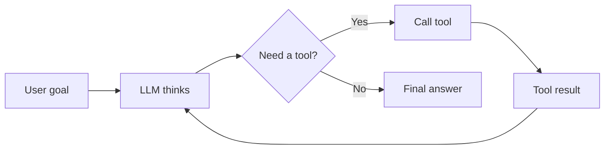
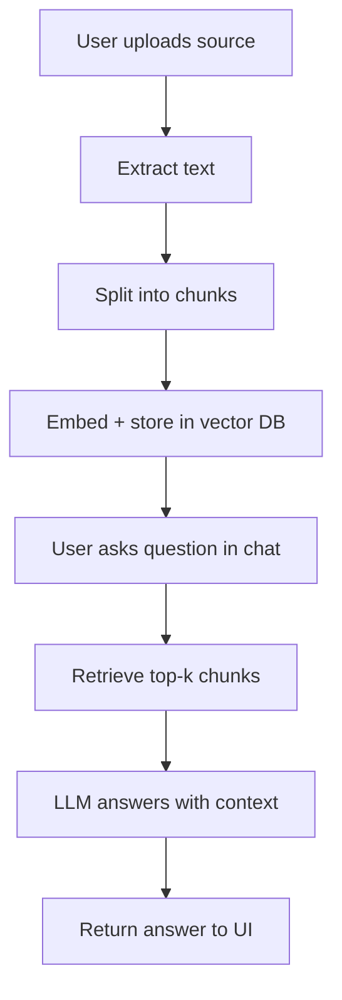
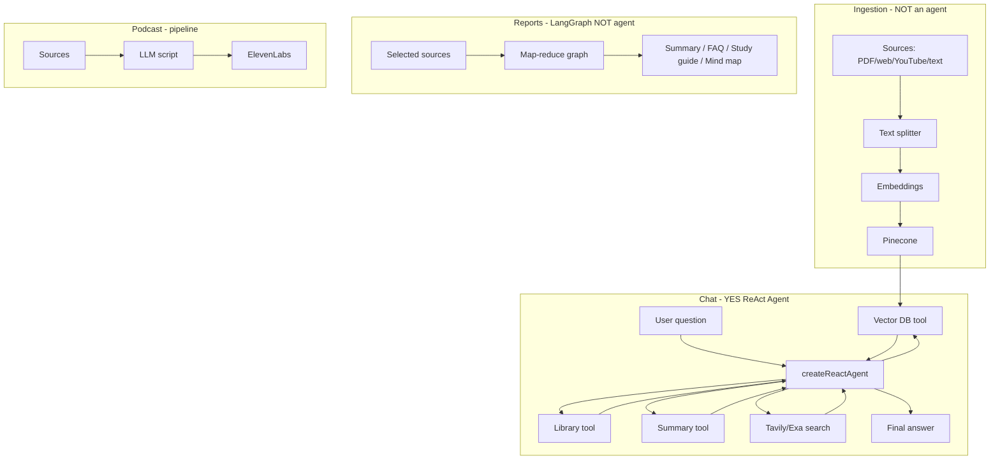
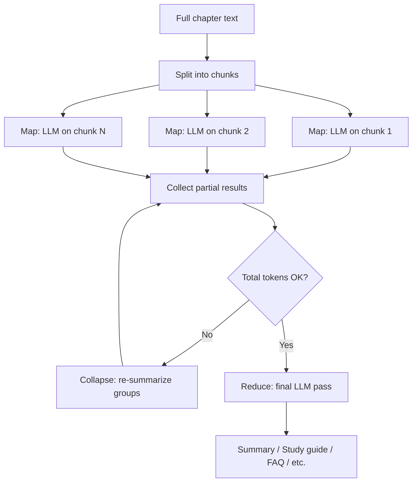
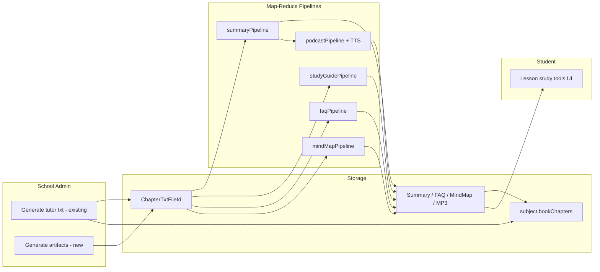
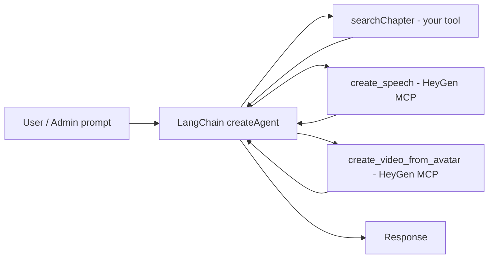
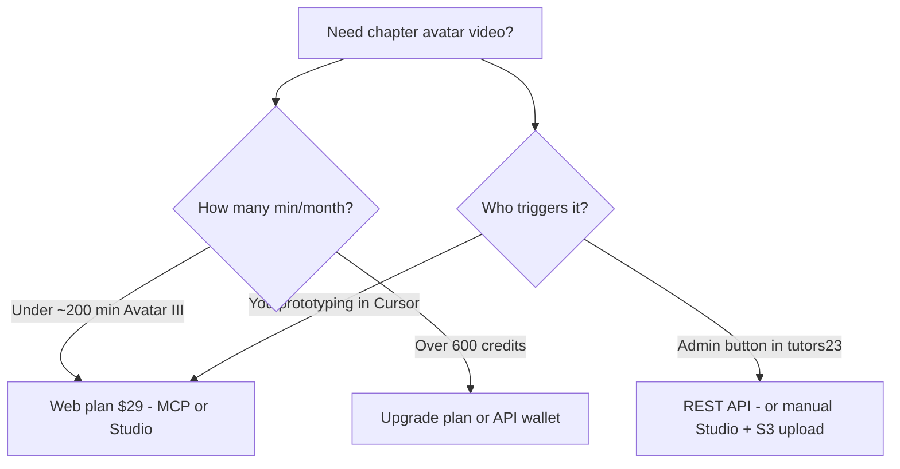
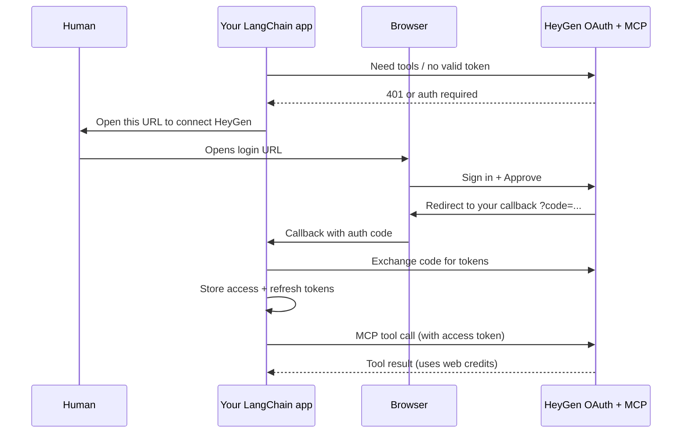
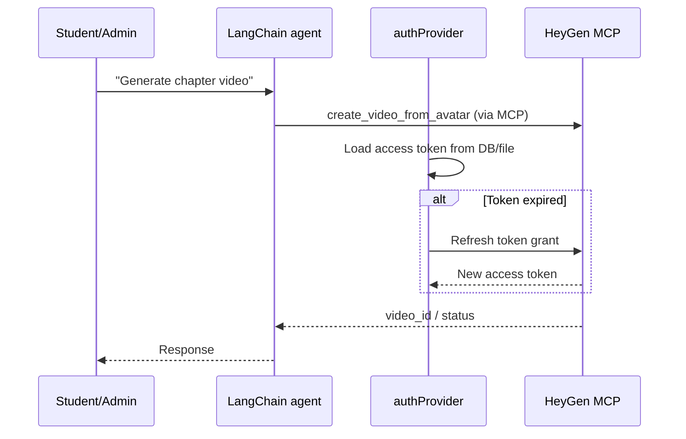

# AI agents overview
_Exported on 7/2/2026 at 09:41:42 CST from Cursor (3.9.16)_

---

**User**

@/Users/juanluissv/.cursor/projects/Users-juanluissv-Desktop-tutors23/agent-transcripts/0fdc0445-16b6-473e-aea6-051e9ef23d1d/0fdc0445-16b6-473e-aea6-051e9ef23d1d.jsonl what are AI agents ? how do they work ? can use node JS to make one ? llamaindex ? langchain ?

---

**Cursor**

I'll read the referenced transcript and scan the codebase for any agent-related patterns so the answer matches your project context.


Reviewing your RAG setup and ingestion code to tailor the explanation to your project.


You’ve been circling this topic from a few angles — HeyGen’s **Video Agent**, **MCP connectors**, and your own tutor chat — so it helps to separate three ideas that often get lumped together: **LLM chat**, **RAG**, and **AI agents**.

## What is an AI agent?

An **AI agent** is an LLM-driven system that can **pursue a goal over multiple steps** by:

1. **Reasoning** about what to do next  
2. **Choosing actions** (calling tools/APIs, querying data, running code)  
3. **Observing results**  
4. **Repeating** until the task is done or it stops  

A plain chatbot answers one question at a time. A RAG chatbot retrieves context first, then answers. An **agent** can *decide* which tools to use and in what order.

Examples in your world:

| System | Agent? | Why |
|--------|--------|-----|
| Your current `/api/chat` endpoint | **No** — it’s RAG | Always: retrieve from Pinecone → answer |
| HeyGen **Video Agent** | **Yes** | Script, avatar, scenes, render — multi-step |
| Cursor + HeyGen MCP | **Yes** | You ask; it picks MCP tools and runs them |
| “Generate chapter video from `.txt` on button click” | **No** — it’s a pipeline | Fixed steps in code, no LLM deciding |

So “agent” means **autonomy + tool use + multi-step planning**, not just “uses AI.”

---

## How do agents work? (The loop)

Most agents follow the same pattern:



Concrete pieces:

1. **LLM** — planner/reasoner (GPT-4o, Claude, etc.)
2. **Tools** — functions the model can invoke (search DB, TTS, HeyGen API, send email)
3. **Memory** — conversation history, retrieved docs, prior tool outputs
4. **Orchestrator** — runs the loop, parses tool calls, handles errors/retries

**MCP (Model Context Protocol)** is one standard way to expose tools to agents. HeyGen MCP gives an agent tools like `create_video_from_avatar` without you writing REST glue in the agent host — but your Express backend can call the same capabilities via REST directly ([HeyGen MCP overview](https://developers.heygen.com/mcp/overview)).

---

## Can you build one with Node.js?

**Yes.** Node.js is a common choice for production agents because you already run Express, MongoDB, S3, Pinecone, etc. there.

Typical stack:

- **`openai` SDK** — chat completions with function/tool calling  
- **LlamaIndex TS** — RAG + workflows/agents  
- **LangChain JS** — agents, chains, tool routing  
- **Vercel AI SDK** — streaming + tool calling in Node/Next  
- **Custom loop** — sometimes the simplest: `while` loop + tool registry + OpenAI `tools` param  

Your project already uses Node + LlamaIndex for RAG:

```57:60:src/controllers/chatController.js
      const queryEngine = index.asQueryEngine();
  const result = await queryEngine.query({
    query: questionTrim,
  });
```

That’s **retrieve-then-answer**, not an agent. Upgrading to an agent would mean the LLM could choose actions like “search chapter index,” “fetch lesson metadata,” or “summarize for a quiz” instead of always running the same query path.

---

## LlamaIndex vs LangChain for agents

Both work in Node.js. You’re already on **LlamaIndex** in production JS and have **LangChain** in a Python ingestion script.

| | **LlamaIndex (TS)** | **LangChain (JS)** |
|---|---------------------|---------------------|
| **Strength** | RAG, indexing, query engines | Flexible agent/tool orchestration |
| **Your usage** | `chatController.js`, `ingestion.js`, Pinecone | `ingestion.py` (Python) |
| **Agent support** | Workflows, agents (`@llamaindex/workflow` in your deps) | `createReactAgent`, tool chains |
| **Best when** | Doc Q&A, chapter-scoped tutors | Many tools, complex routing, multi-framework |

**Practical advice for tutors23:**

- **Stay on LlamaIndex** if the main goal is “student asks about this chapter → grounded answer.” You’re already there.
- **Add agent behavior** when you need dynamic steps, e.g.:
  - “Explain this concept, then give me 3 quiz questions, then check my answer”
  - “Find the relevant section, then generate a summary at my reading level”
  - Orchestrating HeyGen/D-ID/TTS as *optional* tools the model picks

You don’t need both frameworks in Node unless you want LangChain’s agent abstractions on top of LlamaIndex retrieval.

---

## Agent vs RAG vs pipeline (for your app)

From your [prior HeyGen/MCP discussion](0fdc0445-16b6-473e-aea6-051e9ef23d1d):

```text
Today (RAG):
  Student question → Pinecone retrieve → GPT answer

Pipeline (not an agent):
  Admin clicks "Generate video" → read .txt → TTS → HeyGen API → S3

Agent (future possibility):
  Student: "I'm stuck on photosynthesis in chapter 3"
    → agent searches chapter index
    → agent pulls specific section
    → agent explains + offers quiz
    → (optional) agent triggers video snippet generation
```

For **batch video generation**, a **deterministic pipeline** (REST API, not MCP) is usually better than an agent — cheaper, predictable, no OAuth in the loop. MCP/agents shine for **interactive, open-ended** tasks.

---

## Minimal Node.js agent shape (conceptual)

```javascript
const tools = {
  searchChapter: async ({ indexName, query }) => { /* Pinecone */ },
  getLessonMeta: async ({ lessonId }) => { /* MongoDB */ },
}

async function runAgent(userMessage, context) {
  const messages = [{ role: 'user', content: userMessage }]

  while (true) {
    const response = await openai.chat.completions.create({
      model: 'gpt-4o-mini',
      messages,
      tools: toolDefinitions,
    })

    const choice = response.choices[0]

    if (!choice.message.tool_calls) {
      return choice.message.content // done
    }

    for (const call of choice.message.tool_calls) {
      const result = await tools[call.function.name](
        JSON.parse(call.function.arguments),
      )
      messages.push(choice.message, {
        role: 'tool',
        tool_call_id: call.id,
        content: JSON.stringify(result),
      })
    }
  }
}
```

LlamaIndex/LangChain wrap this loop with memory, streaming, and error handling.

---

## Summary

| Question | Answer |
|----------|--------|
| What are AI agents? | LLM systems that plan and **use tools in a loop** to reach a goal |
| How do they work? | Think → act (tool) → observe → repeat |
| Node.js? | **Yes** — fits your Express stack well |
| LlamaIndex? | **Yes** — you already use it for RAG; can extend to workflows/agents |
| LangChain? | **Yes** in JS; you use it in Python today for ingestion |
| MCP? | Tool protocol for agents (Cursor, Claude); not ideal for your unattended video pipeline |

Your chat tutor is **RAG today**, which is the right foundation. An **agent** layer on top makes sense when students need multi-step tutoring (explain → quiz → remediate) rather than single Q&A turns.

If you want to go deeper next, we can sketch what a **chapter-scoped tutor agent** would look like on top of your existing Pinecone indexes and `chatController.js` — still guidance-only in Ask mode, or implementation if you switch to Agent mode.

---

**User**

explain to me langchain agent, javascript docs https://docs.langchain.com/oss/javascript/langchain/agents#example-of-react-loop 

---

**Cursor**

Fetching the LangChain JavaScript agents docs, focusing on the ReAct loop example.


Searching for the ReAct loop section in the docs.


Based on the [LangChain JavaScript Agents docs](https://docs.langchain.com/oss/javascript/langchain/agents) and the [ReAct loop section](https://docs.langchain.com/oss/javascript/langchain/agents#example-of-react-loop), here is a practical breakdown.

## The one-line definition

From the docs:

> **An agent is a model calling tools in a loop until a given task is complete.**

LangChain frames it as:

**Agent = Model + Harness**

- **Model** — the LLM that reasons and decides
- **Harness** — everything around the loop: tools, system prompt, memory, middleware, limits

`createAgent()` is that harness. You don't write the loop yourself.

---

## What is the ReAct loop?

**ReAct** = **Re**asoning + **Act**ing.

The model alternates between thinking and doing:

```text
1. Thought   → "I need weather data for San Francisco"
2. Action    → call tool: getWeather({ city: "San Francisco" })
3. Observation → tool returns: "72°F, sunny"
4. Thought   → "I have enough info to answer"
5. Final Answer → "It's 72°F and sunny in San Francisco"
```

If step 4 still needs more data, it goes back to Action → Observation again.

```mermaid
flowchart TD
  U[User message] --> M[Model reasons]
  M --> D{Tool calls?}
  D -->|Yes| T[Execute tool(s)]
  T --> O[Tool result added to messages]
  O --> M
  D -->|No| A[Final answer to user]
```

That is the loop the docs illustrate under **"Example of ReAct loop"**. `createAgent` runs it automatically until the model stops requesting tools.

---

## How `createAgent` works (minimal example)

From the [docs](https://docs.langchain.com/oss/javascript/langchain/agents):

```typescript
import { createAgent, tool } from 'langchain'
import * as z from 'zod'

// 1. Define tools the agent can use
const search = tool(
  ({ query }) => `Results for: ${query}`,
  {
    name: 'search',
    description: 'Search for information',
    schema: z.object({ query: z.string() }),
  },
)

// 2. Create the agent (model + tools + ReAct loop)
const agent = createAgent({
  model: 'openai:gpt-4o-mini',
  tools: [search],
  systemPrompt: 'You are a helpful assistant. Be concise.',
})

// 3. Invoke — the loop runs internally
const result = await agent.invoke({
  messages: [
    { role: 'user', content: 'Search for photosynthesis and summarize' },
  ],
})
```

What happens on `invoke`:

| Step | What LangChain does |
|------|---------------------|
| 1 | Sends user message + tool definitions to the model |
| 2 | Model returns either text **or** tool call(s) |
| 3 | If tool calls → runs your JS functions → appends results as `tool` messages |
| 4 | Sends updated message history back to the model |
| 5 | Repeats until the model responds with **no tool calls** |
| 6 | Returns final state (including full `messages` array) |

Under the hood this is built on **LangGraph** — a state machine with a conditional edge: "call tools again, or finish?"

---

## Core pieces from the docs

### 1. Model

Pass a provider string or a configured model instance:

```typescript
createAgent({ model: 'openai:gpt-4o-mini', tools })
```

### 2. Tools

Tools need three things the model uses to decide:

- **`name`** — what the model calls
- **`description`** — when to use it (very important)
- **`schema`** — Zod schema for arguments

Bad descriptions → wrong tool choices.

### 3. System prompt

Shapes behavior without changing the loop:

```typescript
createAgent({
  model: 'openai:gpt-4o-mini',
  tools,
  systemPrompt: 'You are a chapter tutor. Always search the textbook first.',
})
```

### 4. Memory / multi-turn

For conversation history, add a **checkpointer** and reuse a **`thread_id`**:

```typescript
import { MemorySaver } from '@langchain/langgraph'

const agent = createAgent({
  model: 'openai:gpt-4o-mini',
  tools: [search],
  checkpointer: new MemorySaver(),
})

const config = { configurable: { thread_id: 'student-123-chapter-5' } }

await agent.invoke(
  { messages: [{ role: 'user', content: 'Explain mitosis' }] },
  config,
)

// Follow-up — same thread_id keeps history
await agent.invoke(
  { messages: [{ role: 'user', content: 'Give me a quiz question' }] },
  config,
)
```

### 5. Streaming

`invoke` waits for the full run. For UI progress (tool calls, partial text):

```typescript
const stream = await agent.streamEvents(
  { messages: [{ role: 'user', content: 'Search and summarize' }] },
  { version: 'v3' },
)

for await (const event of stream) {
  // inspect tool calls, messages, etc.
}
```

---

## ReAct loop vs your current chat

Your `chatController.js` is **not** an agent — it's **RAG**:

```57:60:src/controllers/chatController.js
      const queryEngine = index.asQueryEngine();
  const result = await queryEngine.query({
    query: questionTrim,
  });
```

Fixed path every time: **retrieve → answer**. The LLM never chooses actions.

A LangChain agent version could look like:

```text
Student: "Explain photosynthesis and quiz me"

Thought  → need textbook content
Action   → searchChapter({ indexName, query: "photosynthesis" })
Observe  → [chunk text from Pinecone]

Thought  → explain, then create quiz
Action   → generateQuiz({ topic: "photosynthesis", count: 3 })
Observe  → [3 questions]

Final    → explanation + quiz questions
```

The model decides **whether** to search, **when** to quiz, and **how many** steps — that's the agent difference.

---

## Middleware (what makes v1 `createAgent` powerful)

The [LangChain v1 release notes](https://docs.langchain.com/oss/javascript/releases/langchain-v1) describe middleware as hooks into the ReAct loop:

| Middleware | Purpose |
|------------|---------|
| `modelRetryMiddleware` | Retry on rate limits / timeouts |
| `toolRetryMiddleware` | Retry failed tool calls |
| `summarizationMiddleware` | Compress long chat history |
| `humanInTheLoopMiddleware` | Pause before sensitive actions |
| `piiMiddleware` | Strip emails/PII before model sees them |

Example:

```typescript
import {
  createAgent,
  modelRetryMiddleware,
  toolRetryMiddleware,
} from 'langchain'

const agent = createAgent({
  model: 'openai:gpt-4o-mini',
  tools: [searchChapter],
  middleware: [
    modelRetryMiddleware({ maxRetries: 3 }),
    toolRetryMiddleware({ maxRetries: 2 }),
  ],
})
```

---

## Walkthrough: one ReAct cycle in plain English

**User:** "What's the weather in Tokyo and should I bring an umbrella?"

```text
Turn 1 — Model
  Thought: I need current weather for Tokyo
  Action:  getWeather({ city: "Tokyo" })

Turn 2 — Harness runs tool
  Observation: { temp: 18, condition: "rain", humidity: 90 }

Turn 3 — Model (sees observation in message history)
  Thought: It's raining — recommend umbrella
  Final:   "It's 18°C and raining in Tokyo. Yes, bring an umbrella."
  (no tool calls → loop ends)
```

The docs' ReAct example is this pattern generalized: the harness manages message history, tool execution, iteration limits, and termination.

---

## Important notes for your stack

1. **LangChain v1 API** — use `createAgent` from `langchain`, not the older `createReactAgent` from LangGraph directly ([v1 migration](https://docs.langchain.com/oss/javascript/releases/langchain-v1)).

2. **Packages you'd add** (you currently use LlamaIndex in Node, LangChain only in Python):
   ```bash
   npm install langchain @langchain/core @langchain/openai @langchain/langgraph zod
   ```

3. **Tools are just functions** — your Pinecone search, MongoDB lesson lookup, quiz generator, etc. can be wrapped with `tool()`.

4. **Cost & latency** — each loop turn = another LLM call. A 3-tool agent can mean 4+ model calls per user message. RAG is cheaper when you always need one retrieval step.

5. **Structured output** — optional Zod schema for typed responses:
   ```typescript
   const Quiz = z.object({
     questions: z.array(z.object({ q: z.string(), a: z.string() })),
   })

   createAgent({ model, tools, responseFormat: Quiz })
   // result.structuredResponse
   ```

---

## When to use a LangChain agent in tutors23

| Use case | Agent? |
|----------|--------|
| Student asks one question about chapter text | RAG (what you have) is enough |
| Multi-step tutoring: explain → quiz → grade → remediate | Agent fits well |
| Admin batch video generation | Fixed pipeline, not agent |
| Agent picks between search / summarize / quiz tools dynamically | Agent |

---

## Summary

| Concept | Meaning |
|---------|---------|
| **Agent** | LLM + tools + loop until done |
| **ReAct loop** | Reason → Act (tool) → Observe → repeat |
| **`createAgent`** | LangChain's harness that runs the loop for you |
| **Tools** | JS functions with name, description, Zod schema |
| **Harness extras** | Memory, streaming, middleware, guardrails |

The [agents page ReAct example](https://docs.langchain.com/oss/javascript/langchain/agents#example-of-react-loop) is showing that loop — you define model + tools, call `invoke`, and LangChain handles Thought → Action → Observation until the model produces a final answer.

If you want next, I can sketch a concrete `searchChapter` tool design that wraps your existing Pinecone/LlamaIndex setup inside a LangChain agent — still guidance-only in Ask mode.

---

**User**

can a langchain agent interact with mcp server ?

---

**Cursor**

Checking current LangChain MCP integration options and any usage in your project.


**Yes.** A LangChain agent can use tools exposed by an MCP server. LangChain does not speak MCP natively inside `createAgent`; the bridge is the official [`@langchain/mcp-adapters`](https://www.npmjs.com/package/@langchain/mcp-adapters) package, documented in [LangChain’s MCP docs](https://docs.langchain.com/oss/javascript/langchain/mcp).

## How it works

MCP servers expose **tools** (and sometimes resources/prompts). The adapter:

1. Connects to one or more MCP servers  
2. Discovers their tools  
3. Converts each MCP tool into a **LangChain-compatible tool**  
4. You pass those tools into `createAgent` like any other tool  

```typescript
import { createAgent } from 'langchain'
import { MultiServerMCPClient } from '@langchain/mcp-adapters'

// 1. Connect to MCP server(s)
const client = new MultiServerMCPClient({
  heygen: {
    transport: 'http',
    url: 'https://mcp.heygen.com/mcp/v1/',
    // OAuth via authProvider for remote servers that require it
  },
  filesystem: {
    transport: 'stdio',
    command: 'npx',
    args: ['-y', '@modelcontextprotocol/server-filesystem', '/tmp'],
  },
})

// 2. Load MCP tools as LangChain tools
const tools = await client.getTools()

// 3. Pass to agent — ReAct loop runs as usual
const agent = createAgent({
  model: 'openai:gpt-4o-mini',
  tools,
})

const result = await agent.invoke({
  messages: [
    { role: 'user', content: 'Create a 30-second tutor video with HeyGen' },
  ],
})
```

The agent’s ReAct loop is unchanged: the model picks a tool → adapter calls the MCP server → result comes back as an observation → model continues or finishes.

---

## Supported transports

| Transport | Use case |
|-----------|----------|
| **`stdio`** | Local MCP server as a subprocess (`npx`, `node server.js`) |
| **`http`** (streamable HTTP) | Remote hosted MCP like HeyGen (`https://mcp.heygen.com/mcp/v1/`) |
| **SSE fallback** | Older MCP servers; adapter can fall back automatically |

For **OAuth-protected** remote servers (HeyGen MCP uses OAuth, not API keys), the adapter supports an `authProvider` for token refresh and the OAuth flow — see the [npm package docs](https://www.npmjs.com/package/@langchain/mcp-adapters).

---

## Architecture

```mermaid
flowchart LR
  U[User] --> A[LangChain createAgent]
  A --> M[LLM decides tool]
  M --> AD[@langchain/mcp-adapters]
  AD --> S1[MCP Server A - HeyGen]
  AD --> S2[MCP Server B - filesystem]
  S1 --> AD
  S2 --> AD
  AD --> A
  A --> U
```

MCP is the **tool layer**. LangChain is the **agent loop** (reason → act → observe).

---

## What MCP gives you vs writing REST yourself

| | **MCP + LangChain agent** | **Direct REST API** |
|---|---------------------------|---------------------|
| Tool discovery | Automatic from server | You define each endpoint |
| Auth | OAuth flow (HeyGen MCP) | API key in headers |
| Best for | Agent-driven, interactive workflows | Fixed production pipelines |
| Your Express backend | Possible but awkward (OAuth, whitelisting) | Natural fit |

From your earlier HeyGen discussion: MCP works well when **an AI agent** (Cursor, Claude, a LangChain agent you run locally) decides to call HeyGen tools. For **school admin clicks “Generate video”** in tutors23, a direct HeyGen REST API call from Express is usually simpler and more reliable.

---

## Practical considerations

**1. Stateless by default**  
`MultiServerMCPClient` opens a session per tool call by default. Fine for most agents; for high-throughput production you may want connection pooling or direct API calls instead.

**2. Error handling**  
When an MCP tool fails, the adapter raises a `ToolException`. Wrap calls or use middleware — errors are not always returned to the model as a failed tool message (unlike the Python adapter).

**3. Multiple servers**  
One agent can use tools from HeyGen, filesystem, database, etc. at once — that’s MCP’s main value.

**4. Not the same as Cursor MCP**  
Cursor connects to MCP servers in the IDE. Your Node app would use `@langchain/mcp-adapters` to do the same thing programmatically inside a LangChain agent.

**5. Packages needed**

```bash
npm install langchain @langchain/mcp-adapters @langchain/core @langchain/openai @langchain/langgraph
```

---

## Example for your tutors23 context

A LangChain agent with MCP could theoretically:

- **`searchChapter`** — your own tool (Pinecone/LlamaIndex)  
- **`create_video_from_avatar`** — from HeyGen MCP  
- **`create_speech`** — from HeyGen MCP  

The agent would decide: “Student wants a video explanation → search chapter → call HeyGen.”

That’s powerful for **prototyping**, but for production video generation you’d still want:

- Stable **API key** auth (not OAuth in a loop)  
- **Async job polling**  
- **Cost tracking** per chapter  
- **No human in the loop**

So: **yes, LangChain agents can use MCP**, but for tutors23 you’d likely use MCP for **dev/experimentation** and REST APIs for **production batch jobs**.

---

## Summary

| Question | Answer |
|----------|--------|
| Can a LangChain agent use MCP? | **Yes**, via `@langchain/mcp-adapters` |
| How? | `MultiServerMCPClient` → `getTools()` → pass to `createAgent` |
| HeyGen MCP specifically? | Yes, via HTTP transport + OAuth `authProvider` |
| Good for your Express app? | Possible, but REST API is better for unattended workflows |
| Good for a tutor agent prototype? | **Yes** — mix your Pinecone tools + HeyGen MCP tools |

If you want, I can outline a minimal architecture for a **chapter tutor agent** that uses your existing LlamaIndex RAG as a local tool plus optional HeyGen MCP — still guidance-only in Ask mode.

---

**User**

can you look a this youtube tutorial https://www.youtube.com/watch?v=qci2YEqDbFk  the teacher is using langchain for a AI NotebookLM Clone that is very similar to what I am doing with tutors23

---

**Cursor**

Searching for details on that tutorial and reviewing your tutors23 setup to compare approaches.


I can’t watch the full video frame-by-frame, but I did pull its metadata and compared it to your tutors23 codebase. Here’s a useful breakdown.

## The video

| | |
|---|---|
| **Title** | [FullStack SaaS AI NotebookLM Clone \| MERN Stack \| React, Node, ShadCN, MongoDB \| LangChain Tutorial](https://www.youtube.com/watch?v=qci2YEqDbFk) |
| **Creator** | [Wizard Engineer](https://www.youtube.com/@wizengineer) |
| **Stack (from title)** | MERN + ShadCN + LangChain.js |

Wizard Engineer also has follow-up parts (e.g. a LangChain v1 / agent upgrade course), so this is likely **Part 1–2 of a multi-part build**, not a single “chat endpoint only” tutorial.

---

## What that tutorial typically builds

NotebookLM-clone tutorials in this genre (including very similar ones like [Chithhi LM](https://github.com/Yasho321/NotebookLM-Clone) and [Chai NotebookLM](https://github.com/ritik913553/Chai-NotebookLm)) usually follow this flow:



**Typical features:**

1. **Ingest sources** — PDF, TXT, URL scrape, sometimes YouTube transcript  
2. **Chunk + embed** — LangChain text splitters + OpenAI embeddings  
3. **Vector store** — often Qdrant (sometimes Pinecone)  
4. **RAG chat** — retrieve relevant chunks → pass to LLM  
5. **SaaS shell** — JWT auth, MongoDB for users/notebooks/chats  
6. **UI** — React + ShadCN, upload + chat interface  
7. **Later parts** — chat memory, agents, podcast/audio (NotebookLM-style extras)

The core idea: **ground AI answers in user-provided documents**, not the model’s general knowledge.

---

## How tutors23 maps to the same idea

You’re building the **same core pattern**, but scoped for **schools, subjects, and chapters** instead of generic “notebooks.”

### What you already have (very aligned)

| NotebookLM clone pattern | Your tutors23 equivalent |
|--------------------------|--------------------------|
| Upload / ingest documents | Admin generates web lessons from book chapters |
| Extract plain text | `extractBookLessonText()` in `generateChapterTutorTxtFromLesson` |
| Chunk text | `splitText()` in `ingestion.js` (1000-char chunks) |
| Vector DB | Pinecone (per-chapter index via `buildChapterPineconeIndexName`) |
| Store raw source | S3 `.txt` as `ChapterTxtFileId` |
| Chat with your data | `/api/chat` → Pinecone retrieve → GPT answer |
| MERN + MongoDB | Express + React + Mongoose |
| Auth / access control | School admin + student roles, subscription gate on chat |

Your ingestion pipeline:

```text
Web lesson content
  → extract plain text
  → upload .txt to S3 (ChapterTxtFileId)
  → chunk + embed into Pinecone (pineconeIndexName)
  → student chats against that index
```

That is **RAG for education**, same family as NotebookLM — just with a fixed curriculum structure instead of “user uploads anything.”

### Your chat endpoint today

```57:60:src/controllers/chatController.js
      const queryEngine = index.asQueryEngine();
  const result = await queryEngine.query({
    query: questionTrim,
  });
```

Same job as the tutorial’s LangChain RAG chain: **retrieve → generate**. You use **LlamaIndex** instead of LangChain.js for that step.

---

## Key differences (where tutors23 goes beyond the tutorial)

| | **NotebookLM clone tutorial** | **tutors23** |
|---|-------------------------------|--------------|
| **Content model** | User uploads arbitrary files | Structured book → chapter → lesson hierarchy |
| **Who ingests** | End user | School admin (batch, curriculum-driven) |
| **Vector scope** | One collection per notebook/upload | One Pinecone index **per chapter** |
| **RAG library** | LangChain.js (`@langchain/openai`, `@langchain/qdrant`) | LlamaIndex + Pinecone |
| **Multi-tenancy** | Usually single-user SaaS | Schools, subjects, grades, subscriptions |
| **Beyond chat** | Sometimes podcast/summary | Web lessons, TTS, planned avatar videos (HeyGen) |
| **Agents** | Often added in later course parts | Not yet — fixed RAG query path |

So: the tutorial is a **generic SaaS NotebookLM**. tutors23 is a **vertical ed-tech product** with the same RAG engine at the center, plus LMS structure on top.

---

## LangChain pieces from the tutorial vs what you use

The tutorial likely uses LangChain for:

```text
Document loaders  →  Text splitters  →  Embeddings  →  Vector store  →  Retriever  →  Chat chain
```

Your stack:

```text
extractBookLessonText  →  splitText (custom)  →  OpenAI embeddings (LlamaIndex)  →  Pinecone  →  QueryEngine
```

Functionally equivalent. You’re not missing the concept — you chose LlamaIndex for the RAG layer and LangChain only in a Python ingestion script (`src/utils/ingestion.py`).

---

## What the tutorial might teach that’s worth borrowing

Even without watching every minute, these are the usual “next steps” from this kind of course that fit tutors23:

### 1. LangChain RAG chain instead of (or alongside) LlamaIndex
If you want to follow the tutorial code closely, you’d swap:

```typescript
// Tutorial-style (LangChain)
const retriever = vectorStore.asRetriever({ k: 4 })
const chain = createRetrievalChain({ retriever, llm })
```

for your current LlamaIndex `QueryEngine`. Same pattern, different library.

### 2. Chat history / memory
NotebookLM clones often persist threads. Your chat is **stateless** (one question → one answer). Adding `thread_id` + message history (LangGraph checkpointer or MongoDB) would enable:

- “Explain that again simpler”
- Multi-turn quiz flows

### 3. Citations
Real NotebookLM shows **source citations**. Your RAG returns an answer but doesn’t expose which chunks were used. Adding citations would reduce “is the AI making this up?” concerns for teachers and parents.

### 4. Auto title / summary
Tutorials often generate metadata on upload. You already have chapter titles; you could auto-generate **lesson summaries** or **study guides** from `ChapterTxtFileId`.

### 5. Agents (later course parts)
Wizard Engineer’s Part 3 covers LangChain v1 `createAgent`. That could power:

- “Explain → quiz me → check my answer → remediate”
- Optional tool calls (search chapter, generate flashcards, trigger TTS)

Your current flow doesn’t need an agent for basic Q&A — RAG is enough.

### 6. Audio / podcast (NotebookLM signature feature)
Tutorials sometimes add TTS podcast generation. You’re already heading there with TTS + planned HeyGen avatar videos — that’s **beyond** most clone tutorials.

---

## Side-by-side architecture

```text
NOTEBOOKLM CLONE (tutorial)          tutors23 (you)
─────────────────────────────        ─────────────────────────────
React + ShadCN UI                    React (HomeScreen, StudentLesson, etc.)
     │                                    │
POST /api/upload                     Admin: generate web lesson
     │                                    │
Extract PDF/URL/text                 extractBookLessonText(lesson)
     │                                    │
LangChain split + embed              ingestTextToPinecone()
     │                                    │
Qdrant collection                    Pinecone index (per chapter)
     │                                    │
POST /api/chat                       GET/POST /api/chat
     │                                    │
LangChain retrieval chain            LlamaIndex QueryEngine
     │                                    │
OpenAI answer                        gpt-4o-mini answer
     │                                    │
(future: podcast, agent)             (future: HeyGen video tutor)
```

---

## Should you switch to LangChain?

**Not required.** You’re already doing the same thing:

| Keep LlamaIndex if… | Consider LangChain if… |
|---------------------|------------------------|
| RAG chat works | You want to follow the tutorial code 1:1 |
| You prefer `QueryEngine` simplicity | You want `createAgent`, middleware, MCP adapters |
| Less refactor risk | You want LangGraph memory + streaming + HITL |

A hybrid is common: **keep LlamaIndex for ingestion/retrieval**, add **LangChain agents** only for multi-step tutoring flows.

---

## Bottom line

The [Wizard Engineer tutorial](https://www.youtube.com/watch?v=qci2YEqDbFk) builds a **generic MERN SaaS where users upload sources and chat via LangChain RAG** — essentially open-source NotebookLM.

**tutors23 is the same core idea**, specialized for schools:

- ✅ MERN + MongoDB  
- ✅ Document → chunks → vectors → grounded chat  
- ✅ Admin-driven ingestion (not student uploads)  
- ✅ Per-chapter Pinecone indexes  
- ➕ LMS structure, subscriptions, lessons, TTS/video pipeline  

You’re not starting from zero relative to that tutorial — you’ve already built the **production-shaped version** of what the course teaches as a SaaS demo. The main gaps vs a full NotebookLM clone are usually **chat memory**, **citations**, and optionally **agents/audio** — not the basic RAG pipeline.

If you want, I can map **specific tutorial modules** (upload, indexing, chat route) to your exact files (`bookLessonsController.js`, `ingestion.js`, `chatController.js`) step by step, or outline what it would take to add citations or multi-turn memory while keeping LlamaIndex.

---

**User**

this are the video transcription from the videos, @scripts/video1.txt  @scripts/video2.txt help me Understand what he does on the videos, how he usese  langchain ? does he make a agent with langchain ?

---

**Cursor**

Reading both transcriptions to summarize the tutorial flow and how LangChain is used.


Searching the transcriptions for LangChain usage, agents, and the main workflow steps.


The transcripts are one long line each — extracting LangChain and agent-related sections with targeted searches.


I read both transcripts. Here is what Wizard Engineer builds, how LangChain is used, and whether he makes an **agent** (short answer: **yes, for chat** — but most other AI features are **not** agents).

---

## What the two videos cover

| | **Video 1** (`video1.txt`) | **Video 2** (`video2.txt`) |
|---|---------------------------|---------------------------|
| **Focus** | LangChain/LangGraph **fundamentals** + AI pipelines | **Full MERN app** + wiring everything together |
| **UI** | Demo of finished app at the start | Builds modals, chat page, Redux, panels |
| **AI** | Teaches RAG, tools, graphs, ingestion | Integrates chat agent + report generators |

Together they build a **NotebookLM-style SaaS**: upload/discover sources → embed in Pinecone → chat + generate summary, study guide, FAQ, mind map, briefing, podcast.

---

## Video 1 — what he teaches (foundations)

### 1. Demo of the finished product
At the start he shows:
- Left panel: **sources** (documents)
- Middle: **chat**
- Right: **generated outputs** — summary, study guide, briefing, FAQ, **mind map**, **podcast audio**
- **Discover sources** — web search for a topic (e.g. “what is RAG”) and add results as sources

### 2. RAG pipeline (conceptual + code)
He walks through the classic RAG steps:

```text
User uploads source
  → split into chunks
  → convert to embeddings
  → store in Pinecone (vector DB)
User asks question
  → retriever searches vector DB
  → LLM gets relevant chunks
  → LLM generates grounded answer
```

He also describes a **fallback**: if retrieved data is irrelevant → **web search** (Tavily) → LLM answers from web data.

### 3. LangChain basics (not agents yet)
He teaches, with `@langchain/core` imports (transcribed as “lenchen”):
- **Messages** — system, human, AI
- **Prompt templates** — `ChatPromptTemplate`
- **Structured output** — force JSON / specific fields
- **Tool calling** — LLM can call functions (e.g. multiply, Tavily search)
- **Runnables** — LangChain Expression Language (LCEL), chaining steps with `.invoke()`

### 4. LangGraph for long-document outputs
For **summary, study guide, FAQ, mind map**, he uses **LangGraph map-reduce**, not an agent:

```text
Document
  → split into pieces
  → map: summarize each piece (generate_summary node)
  → collect summaries
  → if too many tokens: collapse summaries
  → generate final summary
```

Nodes mentioned: `map_summary`, `generate_summary`, `collect_summary`, `collapse_summaries`, `generate_final_summary`.

Each output type gets its own pipeline file (e.g. `generateFAQ.ts`, study guide pipeline) — mostly **different prompts**, same map-reduce pattern.

### 5. Ingestion into Pinecone
He builds an **ingestion pipeline** (`injectionPipeline.ts`):
- Load sources: **PDF, web URL, YouTube transcript, text**
- `RecursiveCharacterTextSplitter`
- Embeddings (mentions Cohere; also Pinecone store)
- `vectorStore.addDocuments()` → Pinecone index named something like `notebook-alam`

---

## Video 2 — what he builds (the app)

### 1. Frontend (lots of React)
- **Discovery modal** — topic → web search → add sources
- **Add source modal** — upload, drag-drop, Google Drive, website, YouTube, paste text
- **Chat page** — left / middle / right panels
- **Redux** for shared state
- Express API helpers, OAuth, note/source CRUD

### 2. Embedding sources (same RAG as Video 1)
When a user adds a source:
```text
Document → chunks → embeddings → Pinecone
```
Uses `embedDocFile`-style function from Part 1, filtered by `userId` + `noteId`.

### 3. Yes — he builds a ReAct agent for chat

In the **`chatOverDocs`** controller he explicitly uses:

> **`createReactAgent`** imported from LangChain  
> Passes: **LLM**, **tools**, **message modifier** (system prompt + chat history)

Flow:
```text
User message
  → createReactAgent reasons
  → picks a tool
  → tool runs
  → agent may call more tools
  → final answer
```

**Tools he gives the agent:**

| Tool | Purpose |
|------|---------|
| **Library tool** | List sources the user added to a notebook |
| **Vector DB tool** (`queryVectorDB`) | Semantic search in Pinecone for the user’s docs |
| **Summary tool** | Get summary of a specific document |
| **Search tool** (Tavily / Exa) | Web search when library data isn’t enough |
| **Extend sources** | Add new web sources from search results |

He demos:
- “Give me a quick summary about this library” → agent calls **library tool**
- “What are trending topics in generative AI?” → agent calls **search tool** (web)
- Follow-up “check on Google” → **memory** — agent remembers prior context

Chat history is stored on disk (`storeConversation`) and passed back via **message modifier**.

### 4. Other AI features — mostly NOT agents

These use **LangGraph map-reduce pipelines** from Video 1, triggered by API endpoints:

| Feature | Mechanism |
|---------|-----------|
| Summary | Map-reduce graph |
| Study guide | Map-reduce graph |
| FAQ | Map-reduce + custom prompt |
| Mind map | Pipeline (`generateMindMapFromSources`) |
| Briefing talk | Map-reduce |
| Podcast audio | LLM script → **ElevenLabs** TTS |

So: **chat = agent**; **reports/audio = fixed pipelines**.

---

## How LangChain is used (summary)



---

## Comparison to tutors23

| | **Wizard Engineer (videos)** | **Your tutors23** |
|---|------------------------------|-------------------|
| **Stack** | MERN + LangChain.js + LangGraph + Pinecone | MERN + **LlamaIndex** + Pinecone |
| **Sources** | User uploads anything per “notebook” | Admin generates from **book chapters / lessons** |
| **Ingestion** | PDF, web, YouTube, Drive, discover | `extractBookLessonText` → S3 `.txt` → Pinecone |
| **Chat** | **`createReactAgent`** with multiple tools | **Fixed RAG** — `QueryEngine.query()` only |
| **Vector scope** | Per notebook (`userId` + `noteId` filter) | Per **chapter** (`pineconeIndexName`) |
| **Web search fallback** | Yes (Tavily/Exa via agent) | No |
| **Extra outputs** | Summary, FAQ, mind map, podcast, etc. | Tutor `.txt`, TTS, planned avatar video |
| **Multi-tenancy** | User notebooks | Schools, subjects, subscriptions |

You’re building the **same core idea** (grounded AI over curriculum content). His course adds:
1. A **ReAct agent** for chat (tool picking + web fallback)
2. **NotebookLM-style studio outputs** (map-reduce graphs)
3. **User-driven source ingestion**

---

## Direct answers

**Does he use LangChain?**  
Yes — heavily: prompt templates, tools, runnables, Pinecone store, LangGraph, and `createReactAgent`.

**Does he make an agent?**  
**Yes, for chat** — `createReactAgent` with library, vector search, summary, and web search tools, plus conversation memory.

**Is everything an agent?**  
**No.** Ingestion, summaries, study guides, FAQ, mind maps, and podcasts are **pipelines/graphs**, not agents. Only the **chat over documents** is agentic.

**LangChain v1 note:** He uses **`createReactAgent`** (LangGraph prebuilt). Newer LangChain v1 docs prefer **`createAgent`**, but the idea is the same ReAct loop.

---

## What you could borrow for tutors23

Most relevant from his course:

1. **Agent for chat** — let the model choose: search chapter index vs. fetch lesson summary vs. (optional) web search  
2. **Map-reduce** — auto **study guide / FAQ / chapter summary** from `ChapterTxtFileId`  
3. **Source discovery** — less critical for you (curriculum is predefined)  
4. **Podcast** — you’re already closer with TTS + planned HeyGen video  

You don’t need to rewrite everything in LangChain — your LlamaIndex RAG already covers his **vector DB tool + ingestion** path. The biggest gap vs. his app is the **ReAct agent chat** and **multi-output generators** (summary, FAQ, mind map).

If you want, I can map his specific files (`chatOverDocs`, `createReactAgent`, tools) to exact equivalents in your codebase (`chatController.js`, `ingestion.js`, `bookLessonsController.js`) step by step.

---

**User**

I really like that he implements: summaries, study guides, FAQ, mind maps, and podcasts using ElevenLabs TTS and Map-reduce graph, what is Map-reduce graph ? can I implement summaries, study guides, FAQ, mind maps, and podcasts usign Map-reduce graph in my projects tutors23 ? how would that look like ? what are the steps? 

---

**Cursor**

Reviewing your chapter/lesson pipeline so the map-reduce design maps to tutors23.


## What is a Map-Reduce graph?

It’s a pattern for handling **long documents** that don’t fit in one LLM call.

**Problem:** A chapter might be 20,000+ characters. One prompt with the full text can hit context limits, lose detail, or get truncated.

**Solution — two phases:**

| Phase | What happens |
|-------|----------------|
| **Map** | Split text into chunks → run the LLM on **each chunk separately** (summarize, extract FAQs, etc.) |
| **Reduce** | Combine all partial results → run the LLM **once more** to produce the final output |

**Optional collapse loop:** If combined partial results are still too long, split them again and summarize until under a token budget — then do the final reduce.



In the Wizard Engineer course this is a **LangGraph `StateGraph`**: nodes like `map_summary`, `generate_summary`, `collapse_summaries`, `generate_final_summary`, with conditional edges for the token check.

Important: this is **not an agent**. It’s a **fixed pipeline** — no tool picking, same steps every time. That’s why it fits batch generation (admin clicks “Generate study guide”) better than a ReAct agent.

---

## Can you do this in tutors23?

**Yes.** You already have most of the input layer:

```409:486:src/controllers/bookLessonsController.js
	const plainText = extractBookLessonText(lesson)
	// ...
	chapter.ChapterTxtFileId = upload.Key
	// ...
	await ingestTextToPinecone({
		text: plainText,
		indexName: pineconeIndexName,
		// ...
	})
```

You also already have:

- Plain chapter text on S3 (`ChapterTxtFileId`)
- Chunking in `splitText()` (`ingestion.js`)
- OpenAI TTS in `ttsController.js` (ElevenLabs is optional, same idea)
- Admin UI pattern in `SchoolAdminCreateTutor.jsx`

What you’d add: **generation pipelines** + **storage for outputs** + **student/admin UI to view them**.

---

## How it would look in tutors23

### High-level flow

```text
Admin: "Generate study materials" (per chapter)
  │
  ├─ Read ChapterTxtFileId from S3 (or reuse plainText from lesson)
  ├─ splitText() → chunks (you already do 1000 chars)
  │
  ├─ MAP-REDUCE (LangGraph or plain Node loop)
  │    ├─ summary pipeline
  │    ├─ study guide pipeline
  │    ├─ FAQ pipeline
  │    └─ mind map pipeline (structured JSON)
  │
  ├─ Save results to S3 + MongoDB fields on bookChapters[]
  │
  └─ Optional: podcast pipeline
       ├─ Use summary/study guide as input (shorter)
       ├─ LLM → dialogue script (2 speakers)
       └─ ElevenLabs or OpenAI TTS → MP3 on S3
```

### Suggested new fields on `bookChapters[]`

Extend your chapter schema (like `ChapterTxtFileId` today):

| Field | Content |
|-------|---------|
| `ChapterSummaryFileId` | Markdown or JSON summary |
| `ChapterStudyGuideFileId` | Structured study guide |
| `ChapterFaqFileId` | JSON array `{ q, a }[]` |
| `ChapterMindMapFileId` | JSON `{ nodes, edges }` |
| `ChapterPodcastFileId` | MP3 URL/key |
| `chapterArtifactsStatus` | `{ summary: 'ready', faq: 'generating', ... }` |

Same pattern you use for tutor `.txt`: generate once, cache on S3, don’t regenerate per student.

---

## Step-by-step implementation plan

### Step 1 — Shared chunking utility

Reuse what you have:

```javascript
// Already in ingestion.js
splitText(trimmed, 1000, 0)
```

For map-reduce, you may want **overlap** (e.g. 1000 chars, 150 overlap) so concepts split across chunk boundaries aren’t lost.

Add a helper:

```text
loadChapterText(chapter) → read S3 from ChapterTxtFileId
prepareChunks(text) → splitText with overlap
```

### Step 2 — Shared map-reduce runner

You can implement this **with or without LangGraph**.

**Option A — Simple Node (good start):**

```javascript
async function mapReduceGenerate({ chunks, mapPrompt, reducePrompt, llm }) {
  // MAP: summarize each chunk (can parallelize with Promise.all, limit concurrency)
  const partials = await Promise.all(
    chunks.map((chunk) => llm.invoke(mapPrompt(chunk)))
  )

  // COLLAPSE (if needed): if partials joined length > MAX_TOKENS, re-chunk and re-summarize
  let combined = partials
  while (estimateTokens(combined.join('\n')) > MAX_TOKENS) {
    combined = await collapsePartials(combined, llm)
  }

  // REDUCE: one final call
  return llm.invoke(reducePrompt(combined.join('\n\n')))
}
```

**Option B — LangGraph (matches the tutorial):**

Same logic as nodes + conditional edge “tokens OK? → reduce : collapse”.

For tutors23, Option A is often enough unless you want visual debugging in LangSmith.

### Step 3 — One pipeline per output type (different prompts)

Same graph shape; **only the prompts change**.

| Output | Map prompt (per chunk) | Reduce prompt (final) |
|--------|------------------------|------------------------|
| **Summary** | “Summarize this section in 3–5 bullets.” | “Merge into one coherent chapter summary for students.” |
| **Study guide** | “Extract key terms, definitions, and learning objectives.” | “Build a structured study guide with sections and review questions.” |
| **FAQ** | “Generate 2–3 Q&A pairs from this section.” | “Deduplicate and order 8–12 FAQs for the whole chapter.” |
| **Mind map** | “List main concepts and sub-concepts as JSON nodes.” | “Merge into one hierarchy: root → branches → leaves.” |

Example reduce prompt for FAQ:

```text
You are a teacher. Combine these partial FAQ lists into one final list.
Remove duplicates. Keep answers grounded in the source only.
Return JSON: [{ "question": "...", "answer": "..." }]
```

### Step 4 — Mind map: structured output

Ask the reduce step for **JSON**, not prose:

```json
{
  "title": "Photosynthesis",
  "nodes": [
    { "id": "1", "label": "Photosynthesis", "level": 0 },
    { "id": "2", "label": "Light reactions", "level": 1, "parentId": "1" }
  ]
}
```

Frontend: render with **React Flow**, **Mermaid**, or a mind-map library. Store JSON in S3; student screen loads and renders it.

### Step 5 — API endpoints (mirror `generateChapterTutorTxtFromLesson`)

```text
POST /api/subjects/:id/book-chapters/:chapterId/generate-summary
POST /api/subjects/:id/book-chapters/:chapterId/generate-study-guide
POST /api/subjects/:id/book-chapters/:chapterId/generate-faq
POST /api/subjects/:id/book-chapters/:chapterId/generate-mind-map
POST /api/subjects/:id/book-chapters/:chapterId/generate-podcast
```

Or one endpoint:

```text
POST .../generate-chapter-artifacts
Body: { types: ['summary', 'faq', 'studyGuide', 'mindMap', 'podcast'] }
```

Each handler:

1. Load chapter + verify `ChapterTxtFileId` exists  
2. Read text from S3  
3. Run the right map-reduce pipeline  
4. Upload result to S3  
5. Save file IDs on `subject.bookChapters[]`  
6. Return URLs + status  

Run long jobs **async** (return `202` + poll status) if chapters are large.

### Step 6 — Podcast (map-reduce + TTS)

Podcast is **two steps**, not one graph:

```text
1. MAP-REDUCE (or use existing summary)
   Input: chapter text OR ChapterSummaryFileId
   Output: dialogue script
   
   Prompt: "Write a 3–5 minute podcast between Teacher and Student
            explaining this chapter. Format:
            [{ speaker: 'Alex', text: '...' }, { speaker: 'Sam', text: '...' }]"

2. TTS
   - ElevenLabs: different voice_id per speaker (like the tutorial)
   - OR your existing OpenAI TTS: alternate voices (marin / cedar)
   - Concatenate MP3 segments (ffmpeg) → upload to S3 → ChapterPodcastFileId
```

Using **summary as input** for the podcast saves cost and keeps audio shorter.

### Step 7 — Admin UI

Extend `SchoolAdminCreateTutor.jsx` (same pattern as “Generate tutor text”):

- Buttons: Generate summary | Study guide | FAQ | Mind map | Podcast  
- Show status per artifact (`ready` / `generating` / `error`)  
- Links to preview  

### Step 8 — Student UI

On `StudentLessonPageScreen` or a new “Study tools” tab:

- Summary (readable markdown)  
- FAQ (accordion)  
- Study guide (sections)  
- Mind map (interactive)  
- Podcast (audio player)  

Gate with subscription like chat/TTS.

---

## Concrete architecture diagram for tutors23



---

## LangGraph vs plain Node for you

| | **Plain Node loops** | **LangGraph map-reduce** |
|---|----------------------|---------------------------|
| Learning curve | Lower | Higher (matches tutorial) |
| Fits tutors23 | ✅ Yes | ✅ Yes |
| Debugging | console.log | LangSmith traces |
| Collapse loop | Manual `while` | Built-in conditional edges |
| Dependencies | OpenAI SDK only | `langchain`, `@langchain/langgraph` |

You can start with plain Node + OpenAI, then migrate to LangGraph if you want the same structure as the course.

---

## Cost and performance tips

1. **Generate once per chapter** — cache on S3 (same as tutor `.txt`).  
2. **Parallel map** — `Promise.all` with concurrency limit (e.g. 3–5) to avoid rate limits.  
3. **Podcast from summary** — not full chapter text.  
4. **Mind map / FAQ** — use `response_format: { type: 'json_object' }` or Zod structured output.  
5. **Require `ChapterTxtFileId` first** — same gate as video generation.  
6. **Token budget** — map ~500 tokens/chunk; collapse when reduce input &gt; ~12k tokens.

---

## Minimal file layout (suggested)

```text
src/
  utils/
    mapReduce.js           # shared map / collapse / reduce
    chapterTextLoader.js   # S3 read from ChapterTxtFileId
  pipelines/
    summaryPipeline.js
    studyGuidePipeline.js
    faqPipeline.js
    mindMapPipeline.js
    podcastPipeline.js     # script + TTS
  controllers/
    chapterArtifactsController.js
  routes/
    chapterArtifactsRoutes.js
```

Prompts live in each pipeline file (or `prompts/chapterSummary.js`, etc.).

---

## Summary

| Question | Answer |
|----------|--------|
| What is map-reduce graph? | Split long text → LLM per chunk (map) → merge (reduce), with optional collapse if still too long |
| Can tutors23 use it? | **Yes** — `ChapterTxtFileId` is the perfect input |
| Agent needed? | **No** — fixed pipelines, like the tutorial’s summary/FAQ/mind map |
| Podcast? | Map-reduce (or summary) → dialogue script → ElevenLabs or your OpenAI TTS |
| First step? | Shared `mapReduceGenerate()` + one endpoint (`generate-summary`) + one Mongo/S3 field |

Your existing `generateChapterTutorTxtFromLesson` is **Step 0**. Map-reduce artifacts are **Step 1+** on top of that same `.txt` file.

If you want to go deeper next, I can draft the exact `mapReduceGenerate()` pseudocode and the Mongo schema fields to add to `subjectModel.js` — still guidance-only in Ask mode, or implementation in Agent mode.

---

**User**

so if I implement a langchain agent I can use HeyGen MCP ?

---

**Cursor**

**Yes, technically** — a LangChain agent can use HeyGen MCP, but **how you run it** matters a lot for tutors23.

## Short answer

| Scenario | HeyGen MCP with LangChain agent? |
|----------|----------------------------------|
| Prototype / dev agent (you or Cursor testing) | ✅ Yes |
| Student chat agent that *sometimes* triggers video | ⚠️ Possible, but awkward |
| School admin batch “generate chapter video” button | ❌ Use HeyGen **REST API**, not MCP |

So: **LangChain agent + HeyGen MCP works**, but it’s not the best fit for your main production video pipeline.

---

## How they connect

LangChain doesn’t speak MCP natively. You use **`@langchain/mcp-adapters`**:

```typescript
import { createAgent, tool } from 'langchain'
import { MultiServerMCPClient } from '@langchain/mcp-adapters'

const mcpClient = new MultiServerMCPClient({
  heygen: {
    transport: 'http',
    url: 'https://mcp.heygen.com/mcp/v1/',
    // OAuth — authProvider for token refresh
  },
})

const heygenTools = await mcpClient.getTools()

const localTools = [
  searchChapterTool,  // your Pinecone/LlamaIndex wrapper
  // ...
]

const agent = createAgent({
  model: 'openai:gpt-4o-mini',
  tools: [...localTools, ...heygenTools],
})
```

The agent’s ReAct loop stays the same: the model can pick `create_video_from_avatar`, `create_speech`, `get_video`, etc. from [HeyGen MCP](https://developers.heygen.com/mcp/overview).



---

## Why MCP is tricky in *your* app

From your earlier HeyGen/MCP discussion, these blockers still apply even with a LangChain agent:

### 1. OAuth, not API key
HeyGen Remote MCP uses **OAuth** (sign in to HeyGen), not `x-api-key`. An Express server generating videos for every school admin can’t rely on a one-time browser login the way Cursor does.

### 2. Billing channel
- **MCP (OAuth)** → HeyGen **web plan credits**
- **REST API (API key)** → **prepaid API wallet**, per-second ([pricing](https://developers.heygen.com/docs/pricing))

MCP isn’t automatically cheaper at scale.

### 3. Domain whitelisting
Custom apps may need [domain approval](https://developers.heygen.com/mcp/overview) before connecting to `https://mcp.heygen.com/mcp/v1/`.

### 4. Unattended async jobs
Chapter videos take minutes. Production needs:
- stable auth
- polling `get_video`
- retries, S3 upload, cost tracking

REST API is built for that; MCP is built for **interactive agents** (Cursor, Claude, etc.).

---

## Better split for tutors23

| Feature | Approach |
|---------|----------|
| **RAG chat** | Keep LlamaIndex (or LangChain retriever tool) |
| **Map-reduce** (summary, FAQ, mind map, podcast) | Fixed pipelines — **not** agent, **not** MCP |
| **LangChain agent** (optional) | Multi-step tutoring: search chapter → quiz → explain |
| **HeyGen video (production)** | **REST API** + API key in `.env` |
| **HeyGen MCP** | Dev/prototyping in Cursor, or internal tooling |

For video, the cleaner pattern is **LangChain tools that call your own Express endpoints**, which call HeyGen REST:

```text
Agent → tool: generateChapterVideo({ chapterId })
          → your Express job (TTS → HeyGen API → S3)
          → returns video URL when done
```

Same capabilities as MCP tools, with API-key auth and your job queue.

---

## When agent + HeyGen MCP *does* make sense

- You’re **experimenting** in dev: “make a 30s tutor clip from this chapter summary”
- An **internal admin agent** (you in Cursor, or a local script) with OAuth already connected
- A **human-in-the-loop** flow: agent drafts script → you approve → agent calls HeyGen MCP

Not ideal for: student-facing chat auto-generating videos, or admin batch-generating 50 chapter videos unattended.

---

## Practical recommendation

```text
LangChain agent
  ├─ Tools you own (best for tutors23)
  │    ├─ searchChapter (Pinecone)
  │    ├─ getChapterSummary (S3)
  │    ├─ generateQuiz
  │    └─ enqueueChapterVideo (calls YOUR HeyGen REST pipeline)
  │
  └─ HeyGen MCP (optional, dev only)
       └─ create_video_from_avatar, create_speech, get_video
```

**Summary:** Implementing a LangChain agent **can** use HeyGen MCP via `@langchain/mcp-adapters`, but for tutors23 you’ll want **your own tools + HeyGen REST API** for production video, and reserve MCP for prototyping in Cursor or similar.

If you want next, I can sketch the exact tool list for a **chapter tutor agent** (RAG + map-reduce artifacts + video enqueue) without MCP — still Ask mode, guidance only.

---

**User**

MCP (OAuth) → HeyGen web plan credits is cheapers is $30 and that gives me 600 credits
that is 200 minutes of video with avatar III https://www.heygen.com/pricing 

---

**Cursor**

Checking HeyGen web vs API pricing so we can compare it accurately to your numbers.


You're reading the [HeyGen pricing page](https://www.heygen.com/pricing) correctly. For **Avatar III**, the **web plan credits** path can be much cheaper than **API pay-as-you-go** — but only within the plan’s limits, and MCP still doesn’t solve production integration on its own.

## Your math checks out

From HeyGen’s FAQ on that page:

> **Avatar III: 3 credits/min**

**Creator plan:** $29/mo → **600 credits**

```text
600 credits ÷ 3 credits/min = 200 minutes of Avatar III video per month
```

So **~200 minutes/month for ~$29** on the web plan is right.

---

## Web credits vs API wallet (Avatar III)

| | **Web plan (MCP / Studio / OAuth)** | **API (API key, pay-as-you-go)** |
|---|-------------------------------------|----------------------------------|
| **Billing** | Monthly credits | USD wallet, per second |
| **Avatar III rate** | 3 credits/min | ~$0.0167/sec ([API pricing](https://developers.heygen.com/docs/pricing)) |
| **~200 min cost** | **~$29** (600 credits) | **~$200** (12,000 × $0.0167) |
| **~6 min video** | **18 credits** (~$0.87 if you use full allowance) | **~$6** |

For **Avatar III at moderate volume**, web credits are clearly cheaper **if you stay inside the monthly bucket**.

---

## What that means for tutors23

### Example: 6-minute chapter videos

```text
Per video:  6 min × 3 credits = 18 credits
600 credits ÷ 18 = ~33 chapter videos per month on Creator ($29)
```

| Chapters/month | Web Creator ($29) | API pay-go (~$6/video) |
|----------------|-------------------|-------------------------|
| 5 × 6 min | ✅ fits (~90 credits) | ~$30 |
| 20 × 6 min | ✅ fits (~360 credits) | ~$120 |
| 33 × 6 min | ✅ uses full 600 credits | ~$198 |
| 50 × 6 min | ❌ need Pro/upgrade/top-up | ~$300 |

**Break-even:** If you generate **more than ~5 six-minute videos per month**, the $29 Creator plan already beats API on cost. The gap widens as volume grows, until you hit the **600 credit cap**.

---

## Where MCP fits (and where it doesn’t)

**Price:** MCP OAuth bills against **web plan credits** — so yes, it can use that cheaper Avatar III rate.

**Integration:** That doesn’t fix the production issues:

| | MCP (OAuth + credits) | REST API (API key + wallet) |
|---|------------------------|-----------------------------|
| **Cost (Avatar III)** | ✅ Much cheaper within 600 credits | ❌ ~$0.0167/sec |
| **Unattended admin “Generate video”** | ❌ OAuth, agent-oriented | ✅ API key in `.env` |
| **Async jobs + polling** | Awkward via MCP | ✅ `get_video`, webhooks |
| **Scale beyond 600 credits/mo** | Upgrade plan or buy packs | Pay-as-you-go, predictable |
| **Multi-school automation** | Hard | Straightforward |

So: **MCP is cheaper on paper, but awkward for your Express batch pipeline.**

---

## Practical strategies (cost + integration)

### Option A — Hybrid (often best)

1. **Prototype** avatars/voices in **Cursor + HeyGen MCP** (uses your $29 credits).
2. **Production** batch generation via **REST API** when you need unattended jobs — accept higher per-minute cost, or only API for overflow.

### Option B — Maximize web credits without MCP in production

Use the **HeyGen web UI or Studio** for batch chapter videos manually/semi-manually while you’re under ~200 min/mo — cheap, but not automated inside tutors23.

### Option C — REST API but optimize cost

- **Avatar III Digital Twin** (cheapest API engine)
- **Your OpenAI TTS** (you already have `ttsController.js`) instead of HeyGen TTS
- **Generate once, cache on S3** — no re-render per student
- Chunk long `.txt` only if needed

### Option D — LangChain agent + MCP (dev only)

Fine for experimenting (“make a 30s clip from this summary”) on the **$29 credit pool** — not for school admins clicking a button in your app.

---

## Credit details to remember

From [HeyGen pricing](https://www.heygen.com/pricing):

1. **Avatar III = 3 credits/min** — Avatar IV/V = **20 credits/min** (much more expensive in credits).
2. **Rollover:** unused credits roll over **one month** on monthly plans (not forever if you cancel).
3. **600 credits is a hard monthly budget** on Creator — not unlimited cheap video.
4. **API and web are separate billing** — API wallet does **not** use the same 600 credits.

---

## Updated decision summary



**Bottom line:** You’re right — **MCP/web credits at $29 for ~200 min of Avatar III** beats API pay-go by a lot **within that cap**. The real question isn’t price; it’s **whether you can automate it inside tutors23**. For that, REST API (or generate in Studio and upload to S3) still fits production better than MCP, even if MCP is cheaper per minute.

If you share roughly how many 6-minute chapter videos you expect per month, we can pick Creator vs Pro vs API overflow more precisely.

---

**User**

Help me understand https://developers.heygen.com/mcp/overview  Authenticate with OAuth with LangChain agent + Heygen MCP can the LangChain Authenticate automatically or does he need a human in the loop ? how Authentication works with LangChain agent and Heygen MCP ?

---

**Cursor**

Checking LangChain MCP adapter OAuth docs for the exact flow.


Here’s how **HeyGen MCP OAuth** works with a **LangChain agent**, and where a **human is required** vs where things can run automatically.

Per [HeyGen’s MCP overview](https://developers.heygen.com/mcp/overview):

- Endpoint: `https://mcp.heygen.com/mcp/v1/`
- Auth: **OAuth** (no API key)
- Billing: **web plan credits** (e.g. Creator $29 → 600 credits)
- Custom apps may need [domain whitelisting](https://form.typeform.com/to/m3EYcOaM)

---

## Short answer

| Phase | Human needed? |
|--------|----------------|
| **First connection / login** | **Yes** — someone must sign in to HeyGen and approve access |
| **Later tool calls (same stored tokens)** | **No** — LangChain adapter can attach tokens automatically |
| **Token refresh (access token expired)** | **Usually no** — if HeyGen issued a refresh token, `authProvider` refreshes in the background |
| **Re-auth (revoked, expired refresh, new server)** | **Yes** — human login again |
| **School admin clicks “Generate video” with no prior OAuth** | **Yes** — blocked until auth completes |

So: **LangChain does not “magically” authenticate to HeyGen by itself.** OAuth always starts with a **human approval step** at least once. After that, your app can run **without** a human on each agent turn **if** you stored tokens correctly.

---

## How HeyGen MCP OAuth is meant to work (Cursor / Claude)

This is what the docs describe:

```text
1. You add connector: https://mcp.heygen.com/mcp/v1/
2. You click "Connect"
3. Browser opens → HeyGen login → "Allow access"
4. Tokens saved by Cursor/Claude
5. Agent calls create_video_from_avatar, get_video, etc.
   → billed to your web plan credits
```

**Human in the loop:** step 2–3 (once per connection). After that, Cursor handles tokens for you.

---

## How it works with LangChain + `@langchain/mcp-adapters`

LangChain connects via `MultiServerMCPClient` and an **`authProvider`** (not a raw API key). The adapter can:

- Run the OAuth authorization-code flow (with PKCE)
- **Store** access + refresh tokens
- **Attach** tokens on each MCP tool call
- **Refresh** access tokens when they expire
- **Retry** after 401 if refresh succeeds

Conceptually:

```typescript
import { MultiServerMCPClient } from '@langchain/mcp-adapters'

const client = new MultiServerMCPClient({
  heygen: {
    transport: 'http',
    url: 'https://mcp.heygen.com/mcp/v1/',
    authProvider: new HeyGenOAuthProvider({
      redirectUrl: 'https://yourapp.com/oauth/heygen/callback',
      // you implement: get/set tokens, open auth URL, handle callback
    }),
  },
})

const tools = await client.getTools()
const agent = createAgent({ model: 'openai:gpt-4o-mini', tools })
```

### OAuth flow (first time)



**Human:** required for login + approve (steps with Browser).

### After tokens are stored



**Human:** not required on each request **if** valid tokens exist.

---

## What “automatic” really means

| Automatic | Not automatic |
|-----------|----------------|
| Adding `Authorization: Bearer …` on MCP requests | First-time HeyGen login |
| Refreshing access token with refresh token | User closing/revoking access |
| Agent choosing HeyGen tools in ReAct loop | Domain whitelist approval for your app |
| Retrying after 401 when refresh works | Each school admin using **their own** HeyGen account without logging in |

The [LangChain MCP adapters](https://www.npmjs.com/package/@langchain/mcp-adapters) automate **token lifecycle after OAuth** — not the **initial consent**.

---

## Three setups for tutors23

### 1. Dev / you in Cursor (simplest)

- Connect HeyGen MCP in Cursor once (OAuth).
- You ask the agent to make test videos.
- **Human once** in Cursor settings; then you chat freely.
- Credits: your $29 Creator plan.
- **Not** wired into Express or school admin UI.

### 2. LangChain agent in **your** Node app (single HeyGen account)

```text
You (owner) OAuth once in admin settings
  → tokens saved in MongoDB / encrypted env
  → LangChain agent + HeyGen MCP tools use those tokens
  → all chapter videos bill to YOUR 600 credits/month
```

- **Human once** (you) for initial OAuth.
- Later admin “generate video” can be **unattended** if your backend loads stored tokens.
- Still need: callback route, token storage, domain whitelist, polling `get_video`, S3 upload.

This is the only MCP path that approximates “automatic” for production — and it’s **your** HeyGen account, not each school’s.

### 3. Each school admin uses **their own** HeyGen credits

- Every admin must OAuth **their** HeyGen account.
- **Human in the loop** per admin (at least once).
- Hard in a pure backend job; usually needs a **Connect HeyGen** button in the UI and a redirect flow.

---

## HeyGen-specific constraints

From the [MCP overview](https://developers.heygen.com/mcp/overview):

1. **No API key** — only OAuth tied to a HeyGen user.
2. **Domain whitelisting** — custom apps must request access for your domain.
3. **Credits = that OAuth user’s plan** — `get_current_user` shows remaining credits.
4. **MCP ≠ REST API billing** — web credits vs API wallet are separate products.

---

## LangChain agent + HeyGen MCP: end-to-end picture

```text
┌─────────────────────────────────────────────────────────┐
│  LangChain createAgent (ReAct loop)                      │
│    tools = [ searchChapter, ...heygenMcpTools ]         │
└──────────────────────────┬──────────────────────────────┘
                           │
┌──────────────────────────▼──────────────────────────────┐
│  @langchain/mcp-adapters                                 │
│    - getTools() from HeyGen MCP                          │
│    - authProvider: tokens + refresh                      │
└──────────────────────────┬──────────────────────────────┘
                           │ HTTPS + Bearer token
┌──────────────────────────▼──────────────────────────────┐
│  https://mcp.heygen.com/mcp/v1/                          │
│    create_video_from_avatar, get_video, create_speech…   │
└──────────────────────────┬──────────────────────────────┘
                           │
                           ▼
                    Web plan credits ($29 / 600)
```

The **agent** decides *when* to call HeyGen tools.  
**OAuth** decides *who* pays and *whether* the call is allowed.  
They are separate layers.

---

## For your tutors23 “admin generates chapter video” flow

| Approach | First auth | Unattended batch | Uses cheap web credits |
|----------|------------|------------------|-------------------------|
| **Cursor + MCP (dev)** | You, once | No | Yes |
| **LangChain + MCP + your stored tokens** | You, once | Possible | Yes |
| **LangChain + MCP + per-admin OAuth** | Each admin | Awkward | Per-admin plan |
| **HeyGen REST API + API key** | No OAuth | Easy | No (wallet, ~$0.0167/s Avatar III) |

Given you care about **$29 / ~200 min Avatar III**, MCP + **one-time OAuth + stored tokens** on **your** account is the cost-optimal automation path — but you still must build OAuth callback, token storage, whitelist, and video job polling yourself.

---

## Practical recommendation

**If goal = cheap credits + experiment**  
→ Cursor or a small LangChain script with HeyGen MCP; OAuth once manually.

**If goal = production “Generate video” in tutors23**  
→ Either:
- **MCP path:** “Connect HeyGen” admin page → store refresh token → backend agent/job uses MCP tools (your account, ~33×6‑min videos/month on Creator), or  
- **REST API path:** simpler ops, higher per-minute cost, no OAuth.

**LangChain does not remove the human from OAuth** — it only automates **after** someone has logged in and you’ve saved tokens.

If you want next, I can outline a minimal OAuth flow for Express (`/auth/heygen/start`, `/auth/heygen/callback`, token model in Mongo) mapped to your `SchoolAdminCreateTutor` flow — still Ask mode, guidance only.

