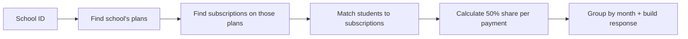

# School admin earnings screen
_Exported on 6/2/2026 at 16:37:33 CST from Cursor (3.4.20)_

---

**User**

please help me with @frontend/src/screens/schoolAdmin/SchoolAdminEarningsScreen.jsx is a screen where the school admin will see the monthly earning of the school, the earnings come from a 50% revenue share from all the subscriptions, calculate the number of students suscriptions and payments for this school to get the monthly earnings, please look at the image as a referecen for the UI design and how screen should look like, but make it look nice and beatiful, make any necessary function controllers, routes and slices

---

**Cursor**

Exploring the codebase to understand subscriptions, school-admin patterns, and the current earnings screen.


Implementing the earnings API and building the dashboard UI to match the reference design.


Building the earnings screen and styles.


The school admin earnings dashboard is wired up end to end. Here’s what was added:

### Backend
- **`src/controllers/earningsController.js`** — `GET /api/schools/:id/earnings`
  - Loads all subscriptions for the school’s plans
  - Applies a **50% revenue share** on each plan price
  - Returns monthly chart data, transaction list, balance summary, and activity feed
- **`src/routes/schoolRoutes.js`** — new `/earnings` route (school-admin protected)
- **`assertSchoolAdminOwnsSchool`** exported from `schoolController.js` for reuse

### Frontend
- **`useGetSchoolEarningsQuery`** in `schoolAdminApiSlice.js`
- **`SchoolAdminEarningsScreen.jsx`** — dashboard modeled on your reference:
  - Recent earnings bar chart (3/6/12 month filter)
  - Transactions table (Date, Status, Type, Amount, Net)
  - Sidebar with total balance, available payout, next payout date
  - Activity feed for recent subscriptions
- **CSS** in `App.css` for the earnings layout
- **“Earnings”** link added to `AdminSidebar`

### How earnings are calculated
Each student subscription payment = the plan’s price. The school earns **50%** of that:

| Gross payment | School net |
|---------------|------------|
| $10.00        | $5.00      |
| $60.00        | $30.00     |

Monthly totals group payments by subscription start date. Total balance is the sum of all net earnings.

Open **`/schooladmins/earnings`** while logged in as a school admin with a linked school. Earnings appear once students subscribe to your school plans (via the simulated payment flow).

---

**User**

@src/controllers/earningsController.js:126-257 explain this to me

---

**Cursor**

Reviewing the full controller for helper context, then explaining the handler.


`getSchoolEarnings` is the API handler for `GET /api/schools/:id/earnings`. It aggregates every student subscription tied to that school’s plans, applies the 50% revenue share, and returns the numbers the earnings dashboard needs.

## What it does at a high level



Each subscription counts as **one payment** equal to the plan price. The school keeps **50%** of that (`REVENUE_SHARE = 0.5`).

---

## Step by step

### 1. Parse inputs and authorize (lines 127–142)

- Reads `schoolId` from the URL (`/api/schools/:id/earnings`).
- Reads optional `?months=` query param (default **12**, clamped between 1 and 24) for the chart period.
- Validates the school ID format.
- Calls `assertSchoolAdminOwnsSchool` so only the admin who owns that school can access the data.

### 2. Load the school’s plans (lines 144–151)

```javascript
Plan.find({ school: schoolId }).select('_id price')
```

Gets every plan belonging to the school and builds a lookup map: `planId → price`. That price is the **gross payment** amount per subscription.

### 3. Early exit if no plans (lines 153–176)

If the school has no plans, it returns zeros everywhere — empty chart buckets, no transactions, no activity. The frontend still gets a valid shape to render.

### 4. Load subscriptions and students (lines 178–192)

```javascript
Subscription.find({ plan: { $in: planIds } })
```

Finds all subscriptions on any of those plans, newest first.

Then it loads students whose `subscriptions` array includes those subscription IDs, and builds `studentBySubId` — a map from subscription ID → student. That’s used to show who paid in the transactions/activity lists.

### 5. Build the time buckets (lines 193–202)

- `buildMonthBuckets(monthsCount)` creates N month slots (e.g. last 12 months), each starting at `{ earnings: 0, payments: 0 }`.
- `periodStart` is the first day of the **oldest** month in that range. It’s used to compute `periodEarnings` (the big number at the top of the chart for the selected period).

### 6. Loop over every subscription (lines 209–235)

For each subscription:

| Step | What happens |
|------|----------------|
| **Get price** | From populated `plan.price`, or fallback to `planPriceById` |
| **Calculate net** | `net = planPrice × 0.5` |
| **Total earnings** | Adds `net` to `totalEarnings` (all-time) |
| **Payment date** | Uses `startDate`, or `createdAt` if no start date |
| **Monthly chart** | If the payment falls in one of the N month buckets, adds `net` and increments `payments` |
| **Period earnings** | If payment date ≥ `periodStart`, adds to `periodEarnings` |
| **Transactions / activity** | Builds row objects with gross, net, status, student name, etc. |

**Important assumption:** one subscription = one payment. Renewals would be separate subscription records.

### 7. Send the response (lines 237–256)

```javascript
{
  revenueShare: 0.5,
  summary: { ... },
  monthlyEarnings: [ ... ],  // bar chart data
  transactions: [ ... ],     // max 50, newest first
  activity: [ ... ]          // max 8 recent events
}
```

| Field | Meaning |
|-------|---------|
| `totalEarnings` / `totalBalance` / `availableToPayout` | Same value today — sum of all 50% shares, ever |
| `periodEarnings` | Sum of 50% shares within the selected month range |
| `totalPayments` | Count of subscriptions |
| `nextPayoutDate` | 1st of next month (placeholder; no real payout system yet) |
| `monthlyEarnings` | One entry per month for the chart |
| `transactions` | Table rows: date, status, gross, net |
| `activity` | Short messages like “Jane Doe subscribed — $5.00 USD earned” |

---

## Example

School has a **$20/month** plan. Three students subscribe:

- Jan: 1 student → school earns **$10**
- Mar: 2 students → school earns **$20**

With `months=12`:

- `totalEarnings` = **$30**
- `periodEarnings` = **$30** (if all fall in the last 12 months)
- `monthlyEarnings` = Jan: $10, Mar: $20, other months: $0
- `transactions` = 3 rows, each gross $20 / net $10

---

## Design choices worth noting

1. **Revenue source** — earnings come from subscriptions on the school’s plans, not from a separate payments table (because payments are simulated when students subscribe).
2. **50% is applied to plan price** — not stored on the subscription; it’s computed at read time.
3. **All-time vs period** — `totalEarnings` is lifetime; `periodEarnings` and `monthlyEarnings` respect the `months` filter.
4. **No payout logic yet** — `availableToPayout` equals total balance; nothing is deducted or held.

If you want, I can walk through how this connects to the frontend screen or suggest changes (e.g. counting renewals differently or storing historical plan prices).

---

**User**

suggest changes

---

**Cursor**

Reviewing the earnings implementation and related code to suggest focused improvements.


Here are focused suggestions for the earnings feature, ordered by impact.

---

## 1. Data model — biggest accuracy gaps

### Add a `Payment` (or `Transaction`) collection
Right now each `Subscription` is treated as one payment. That breaks down when:

- **Renewals** happen (you have `renewal: true` but no renewal payment flow yet).
- **Plan price changes** — earnings use today’s `plan.price`, not the price at purchase time.
- **Refunds / chargebacks** — no way to represent them.

**Suggestion:** On `POST /api/students/subscribe` (and future renewal), create a payment record:

```javascript
{
  school, plan, subscription, student,
  grossAmount, netAmount, revenueShare: 0.5,
  paidAt, status: 'succeeded' | 'refunded' | 'failed'
}
```

Then `getSchoolEarnings` aggregates **payments**, not subscriptions. That matches real billing dashboards.

### Snapshot price on the subscription
Minimal change without a full payments table: add `amountPaid` (and optionally `schoolShare`) on `Subscription` at creation time so historical earnings don’t change when an admin edits plan price.

---

## 2. Backend (`earningsController.js`)

### Scope `totalEarnings` vs `periodEarnings` consistently
Today:

- `periodEarnings` and `monthlyEarnings` respect the `months` window.
- `totalEarnings` / `totalBalance` are **all-time**.

The UI shows `periodEarnings` as “Recent earnings” but the sidebar shows all-time balance — that’s fine if intentional; if not, either:

- Rename API fields (`lifetimeEarnings` vs `periodEarnings`), or  
- Add a query flag `scope=lifetime|period` and document it.

### Filter subscriptions outside the chart window for the loop (optional)
You still load **all** subscriptions and only bucket recent ones. For large schools, query with a date filter on `startDate` / `createdAt` for chart + transactions, and a separate aggregate for lifetime totals.

### Use `school.subscriptions` as a secondary source
`subscribeStudent` adds subscription IDs to `School.subscriptions`. You could cross-check `plan: { $in: planIds }` vs `school.subscriptions` to catch orphans or legacy data.

### Student lookup edge case
`buildStudentLookup` maps subscription → student, but if two students ever shared a subscription ID (shouldn’t happen), last write wins. Low risk; worth a comment or asserting one student per sub.

### Status semantics
`transactionStatus` returns `"Succeeded"` for almost everything; `pastDue` subscriptions still counted as full earnings. **Suggestion:** only count `Succeeded` payments toward earnings; show `pastDue` in the table but with $0 net or a “Pending” badge until paid.

### Configurable revenue share
`REVENUE_SHARE` is hardcoded. Move to env (`SCHOOL_REVENUE_SHARE=0.5`) or per-school field on `School` for flexibility.

### Pagination
Transactions are capped at 50 with no `?page=` or `?cursor=`. Add pagination before the list grows.

---

## 3. Frontend (`SchoolAdminEarningsScreen.jsx`)

### Show plan / student in the table
Transactions have `student` and `planId` in the API but the table doesn’t show them. Add columns (Student, Plan) or a detail row — helps admins reconcile payouts.

### “See all” for transactions
The reference UI had “See all”; you only show up to 50 with no link. Add a full transactions route or expand in-place.

### Align hero number with period filter
When the user picks “Past 3 months”, the big number should clearly be “Earnings in last 3 months” (you already use `periodEarnings`; add a subtitle so it’s not confused with total balance).

### Disable or implement “See details”
The payout button is disabled with a tooltip. Either remove it or wire a simple modal (breakdown by plan, by grade, etc.).

### RTK cache invalidation
`getSchoolEarnings` tags `Earnings` and `Subscription`, but student subscribe may not invalidate school admin earnings. Ensure `subscribeStudent` (or plan/student mutations) invalidate `{ type: 'Earnings', id: schoolId }` so the dashboard updates without manual refresh.

### Extract shared helpers
`resolveSchoolId`, `formatCurrency`, etc. are duplicated across school admin screens — move to `frontend/src/utils/` to match `gradeLevel.js` / `subscriptionAccess.js`.

---

## 4. Business / product logic

| Topic | Current behavior | Suggested change |
|--------|------------------|------------------|
| Renewals | Not implemented | Each renewal = new payment row; monthly recurring revenue in chart |
| Payouts | `availableToPayout === totalBalance` | Track `paidOut`, `pending`, `hold` when you integrate Stripe Connect |
| Currency | Hardcoded USD | Use plan currency or school country default |
| Tax / fees | Not modeled | Optional `platformFee` so net = gross × share − fees |
| Inactive plans | Old subs still count | Fine; optionally filter `status: 'cancelled'` subs from earnings |

---

## 5. Quick wins (low effort, good payoff)

1. **`amountPaid` on subscription** at subscribe time — fixes price-change bugs.  
2. **Subtitle on UI** — “Last 12 months” under the chart total.  
3. **Invalidate `Earnings` tag** when students subscribe.  
4. **Don’t count `pastDue` toward earnings** until payment succeeds.  
5. **`lifetimeEarnings` naming** in API response for clarity.

---

## 6. What I’d do first

If you’re preparing for real payments:

1. `Payment` model + write on subscribe.  
2. Earnings controller reads from `Payment`.  
3. Frontend shows student + plan in transactions.

If you’re staying on simulated payments for now:

1. Snapshot `amountPaid` on subscription.  
2. Fix RTK invalidation + UI labels.  
3. Exclude `pastDue` from earned totals.

---

I’m in **Ask mode**, so I can’t apply these changes. Switch to **Agent mode** if you want me to implement any of them (e.g. Payment model + controller refactor, or the quick wins only).

---

**User**

quick wins only

---

**Cursor**

Implementing the five quick wins: reviewing the current code, then applying focused changes.


Implementing all five quick wins.


Implemented all five quick wins:

### 1. `amountPaid` on subscription
- Added `amountPaid` to `subscriptionModel.js`
- Set at subscribe time from `plan.price` in `subscriptionController.js`
- Earnings use `amountPaid` when present, otherwise fall back to current plan price

### 2. Period subtitle on chart
- Under the chart total: e.g. **“Past 12 months · 50% revenue share”** (updates with the period dropdown)

### 3. RTK cache invalidation
- Added `'Earnings'` to `apiSlice` tag types
- Student `subscribe` mutation now invalidates `Earnings` and `Subscription` so the school admin dashboard refreshes after a student pays

### 4. Exclude `pastDue` from earnings
- Past-due subs still appear in the transactions table with **$0 net**
- They are **not** counted in lifetime/period totals, monthly bars, activity feed, or `totalPayments`

### 5. `lifetimeEarnings` naming
- API returns `summary.lifetimeEarnings` (with `totalEarnings` kept as an alias)
- Sidebar balance uses `lifetimeEarnings` with subtitle **“All-time earnings”**

Shared constant moved to `src/utils/revenueShare.js` for subscribe + earnings logic.

---

**User**

explain to me the changes that you just did 

---

**Cursor**

Reviewing the updated files to explain the quick-win changes accurately.


Here’s what the **quick wins** changed and why.

---

## 1. Snapshot `amountPaid` when a student subscribes

**Before:** Earnings always used the plan’s **current** `price`. If an admin later changed the plan from $20 → $30, old subscriptions would look like they paid $30.

**After:**
- New field on `Subscription`: `amountPaid`
- On subscribe (`subscriptionController.js`), the app stores `plan.price` at that moment
- Earnings use `getGrossAmount()` — prefer `amountPaid`, fall back to plan price for older subs without the field

```76:80:src/controllers/earningsController.js
function getGrossAmount (subscription, planPrice) {
    if (subscription.amountPaid != null) {
        return roundMoney(subscription.amountPaid);
    }
    return roundMoney(planPrice);
}
```

**Why it matters:** Historical earnings stay correct even if plan prices change.

---

## 2. Clearer labels on the earnings UI

**Chart (main number):**
- Big number = `periodEarnings` (selected window: 3 / 6 / 12 months)
- New subtitle: e.g. **“Past 12 months · 50% revenue share”** so it’s not confused with all-time balance

**Sidebar (“Total balance”):**
- Uses `lifetimeEarnings` (all successful payments ever)
- New subtitle: **“All-time earnings”**

So: **chart = this period**, **sidebar = lifetime**.

---

## 3. Auto-refresh earnings after a student pays

**Before:** School admin earnings could stay stale until a manual refresh.

**After:**
- `Earnings` added to RTK `tagTypes` in `apiSlice.js`
- Student `subscribe` mutation invalidates `'Earnings'` and `'Subscription'`
- `getSchoolEarnings` already provides `{ type: 'Earnings', id: schoolId }`

When a student subscribes, any open earnings query refetches.

---

## 4. Past-due subscriptions don’t count as earned money

**Before:** Every subscription added full net to totals, even if `pastDue: true`.

**After:** `countsTowardEarnings()` only returns true when `pastDue !== true`.

| What | Past-due behavior |
|------|-------------------|
| Lifetime / period totals | **Not** included |
| Monthly chart bars | **Not** included |
| `totalPayments` | **Not** counted |
| Activity feed | **Not** shown |
| Transactions table | **Still** listed, but **net = $0**, status “Past due” |

So admins still see the row, but money isn’t counted until it’s treated as a successful payment.

---

## 5. `lifetimeEarnings` in the API (clearer naming)

**Before:** Only `totalEarnings`, `totalBalance`, etc. — all the same number, easy to mix up with `periodEarnings`.

**After:** Response includes:

```javascript
summary: {
  lifetimeEarnings,      // new, explicit name
  totalEarnings,         // alias (same value, backward compatible)
  totalBalance,
  availableToPayout,
  periodEarnings,        // only within selected months
  totalPayments,         // successful payments only
  totalSubscriptions,    // all subs (including past-due)
}
```

Frontend reads `lifetimeEarnings` first, with fallback to `totalEarnings`.

---

## Small shared refactor

`REVENUE_SHARE` (0.5) moved to `src/utils/revenueShare.js` so subscribe and earnings use the same constant instead of duplicating `0.5`.

---

## Files touched (summary)

| Area | Files |
|------|--------|
| Data | `subscriptionModel.js` |
| Subscribe | `subscriptionController.js` |
| Earnings math | `earningsController.js` |
| Constant | `revenueShare.js` |
| Cache | `apiSlice.js`, `studentApiSlice.js` |
| UI | `SchoolAdminEarningsScreen.jsx`, `App.css` |

---

## What did *not* change

- No `Payment` collection yet  
- No real payout / Stripe logic  
- Renewals still = one subscription record per payment (when renewals exist, each new sub gets its own `amountPaid`)

Existing subscriptions without `amountPaid` still work via plan price fallback. Only **new** subscriptions get the snapshot.

